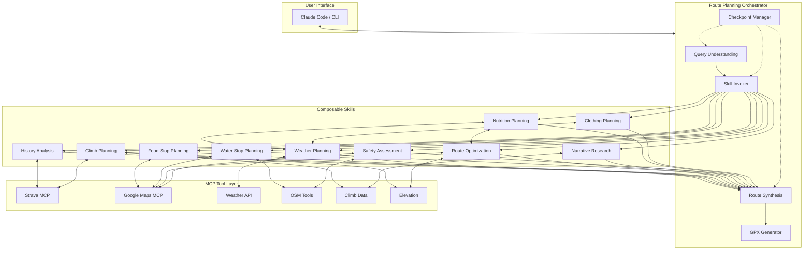
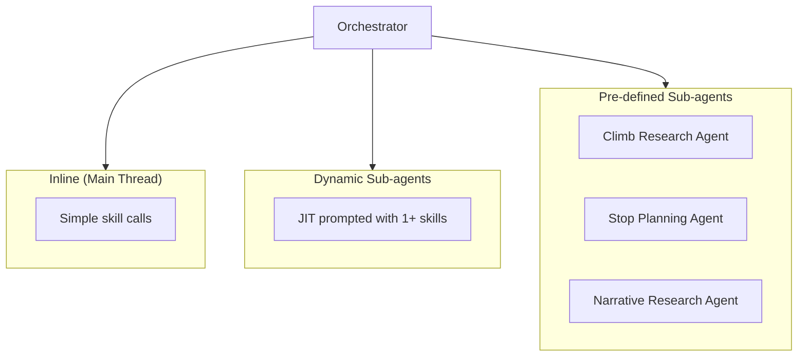
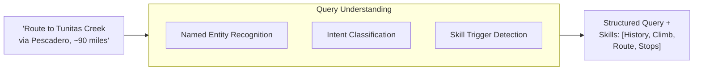
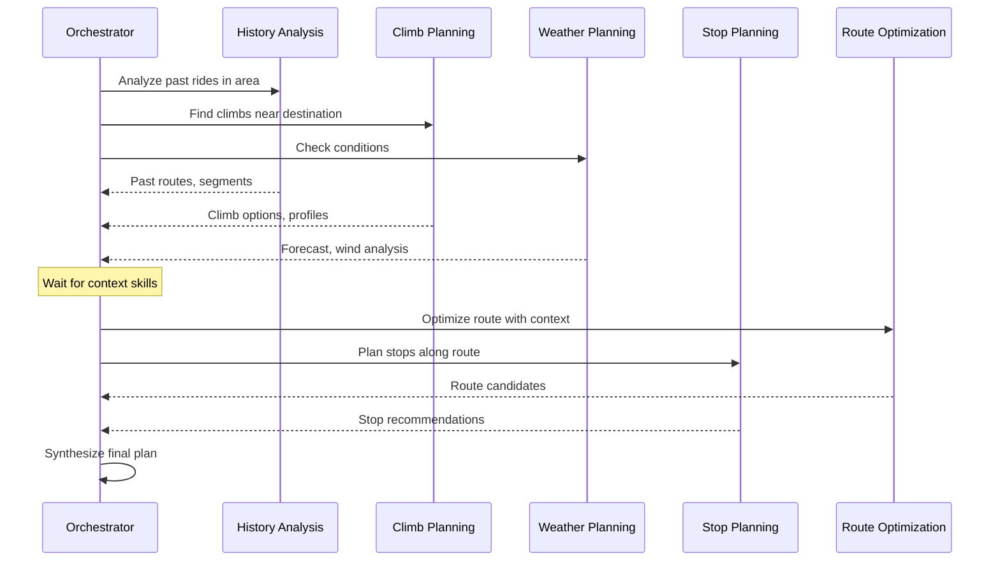
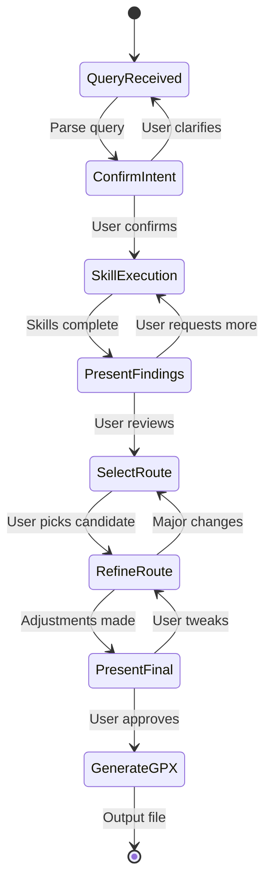

# Architecture

## System Overview

The Route Agent is built on Claude Agent SDK, using MCP (Model Context Protocol) to integrate multiple data sources. The architecture uses **composable skills** to manage context and enable conditional invocation based on route requirements.



## Core Concepts

### Skills vs Tools

**Tools** are external data sources (Strava API, Google Maps, weather services). They return raw data.

**Skills** are composable agent capabilities that use tools and encode domain expertise. Each skill:
- Has focused context (doesn't need to know about everything)
- Can be invoked conditionally based on route requirements
- Returns structured summaries, not raw data dumps
- May use one or more tools

This separation allows the orchestrator to invoke only relevant skills, keeping context focused and avoiding overload.

### Tool Criticality

Tools are classified as **Critical** or **Enhancing**:

| Type | Behavior on Failure | Examples |
|------|---------------------|----------|
| **Critical** | Block - cannot proceed | Routing (GraphHopper), Activity History (Strava) |
| **Enhancing** | Degrade gracefully - skip that enrichment | PJAMM narratives, Web search, Weather details |

The agent should complete a useful route even if enhancing tools fail. For example, if PJAMM API is unavailable, we still produce a route - just without climb narratives.

### Orchestration Model

The orchestrator has flexibility in how it composes skills:

1. **Direct invocation**: Use a skill inline in the main thread
2. **Single-skill sub-agent**: Spawn a focused sub-agent for one skill
3. **Multi-skill sub-agent**: Spawn a sub-agent with access to multiple skills
4. **Pre-defined sub-agents**: Well-scoped agents for common patterns



**Design principle**: Skills exist for flexible composition. The orchestrator decides based on query complexity whether to invoke skills directly, spawn a general sub-agent with JIT prompting, or use a specialized pre-defined sub-agent.

### Skills vs Sub-agents

| Use a Skill when... | Use a Sub-agent when... |
|---------------------|------------------------|
| Task requires route context | Task is a focused lookup |
| Complex reasoning needed | Returns small, structured data |
| Affects route planning decisions | Doesn't need route context |
| Invoked conditionally by orchestrator | Invoked by a skill as helper |

**Example**: Nutrition Planning is a skill (needs route profile, weather, stop locations). Nutrition Facts lookup is a sub-agent (takes product name, returns macros).

### Conditional Skill Invocation

See [skills.md](skills.md#conditional-invocation) for skill trigger conditions.

## Component Details

### Query Understanding

Parses user intent into structured route requirements and determines which skills to invoke:

- **Destination(s)**: Named places, climbs, or coordinates
- **Distance**: Target range (e.g., 80-100 miles)
- **Constraints**: Must-visit points, avoid areas, surface preferences
- **Reference**: Past activities to use as starting points
- **Skill Triggers**: What conditions require which skills



### Skill Invoker

Orchestrates skill execution based on query analysis:

1. **Parallel Fan-out**: Independent skills run concurrently
2. **Sequential Dependencies**: Some skills inform others
3. **Context Isolation**: Each skill gets focused context
4. **Result Aggregation**: Combine skill outputs for synthesis



### Checkpoint Manager

Manages interaction flow through structured pauses where the user provides input:



| Checkpoint | Purpose |
|------------|---------|
| Confirm Intent | Verify parsed query and skill selection |
| Present Findings | Show skill results |
| Select Route | Choose from route candidates |
| Refine Route | Fine-tune details |
| Present Final | Review before generation |

### Route Synthesis

Combines skill outputs into coherent route candidates:

1. **Segment Stitching**: Connect waypoints using known segments from History skill
2. **Stop Integration**: Insert cafe/water stops from Stop Planning skill
3. **Climb Sequencing**: Order climbs from Climb Planning skill
4. **Weather Adjustment**: Factor in Weather Planning recommendations
5. **Safety Notes**: Include warnings from Safety Assessment skill
6. **Nutrition Schedule**: Integrate fueling plan from Nutrition Planning skill
7. **Clothing Guidance**: Include gear recommendations from Clothing Planning skill

### GPX Generator

Produces final GPX file with:
- Waypoints for key stops (cafes, water, photo ops)
- Track points for the route
- Metadata (name, description, expected stats)
- Notes/warnings in waypoint descriptions

## Skill Implementation

Skills can be implemented as:
1. **Prompt-based skills**: Instructions + tool access
2. **Sub-agents**: Independent agents with focused context
3. **Hybrid**: Sub-agent for complex skills, prompts for simple ones

```typescript
// Skill as sub-agent
const climbPlanningSkill = createAgent({
  name: "climb-planner",
  tools: [climbDataTool, elevationTool, stravaSegments],
  prompt: `You are an expert at planning cycling climbs...`,
});

// Skill as prompt template
const stopPlanningSkill = {
  name: "stop-planner",
  tools: [googlePlaces, osmWater],
  invoke: async (routeCorridor, constraints) => { }
};

// Orchestrator workflow
const routeAgent = createAgent({
  name: "route-planner",
  skills: [historySkill, climbPlanningSkill, weatherSkill, stopPlanningSkill,
           routeOptimizationSkill, safetySkill, nutritionPlanningSkill,
           clothingPlanningSkill],

  workflow: async (input) => {
    const query = await parseQuery(input);
    const skillsNeeded = determineSkills(query);
    await checkpoint("confirmIntent", { query, skillsNeeded });

    const skillResults = await invokeSkills(skillsNeeded, query);
    await checkpoint("presentFindings", skillResults);

    const candidates = await synthesizeRoutes(skillResults);
    const selected = await checkpoint("selectRoute", candidates);

    const refined = await refineRoute(selected);
    await checkpoint("presentFinal", refined);

    return generateGPX(refined);
  }
});
```

## Context Management

See [skills.md](skills.md#context-management) for per-skill context requirements.

The orchestrator maintains global context; skills receive only what they need.

See [tools.md](tools.md) for data source abstractions and [skills.md](skills.md) for research patterns.
