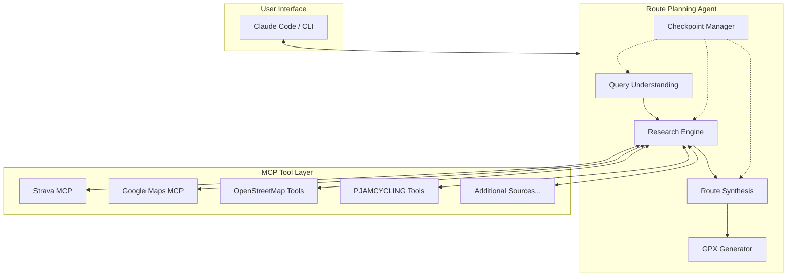
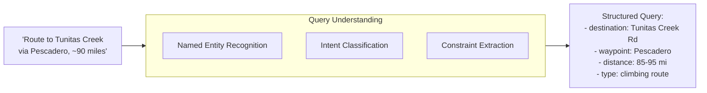
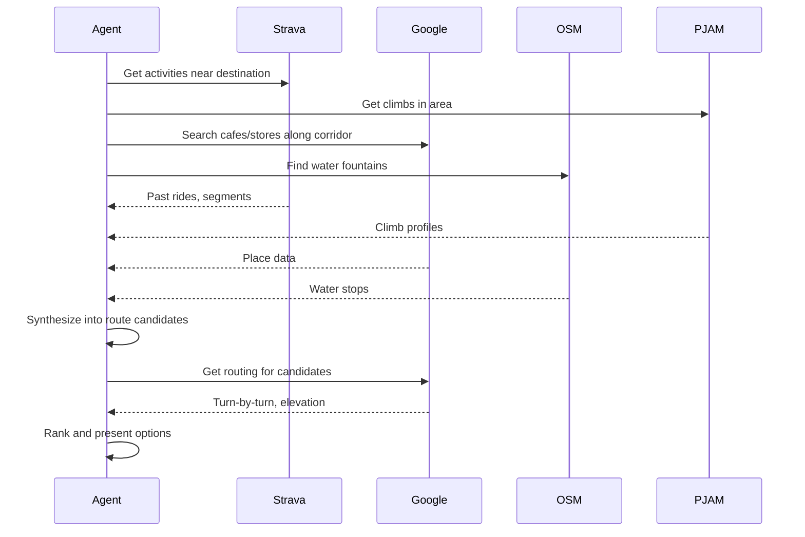
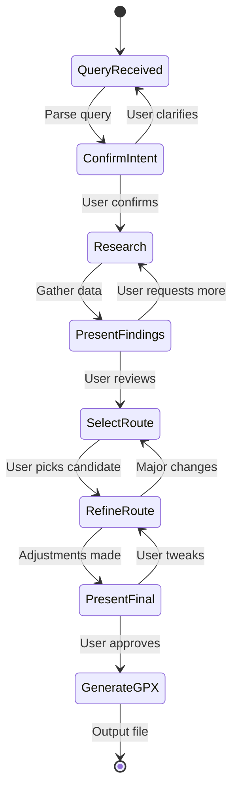
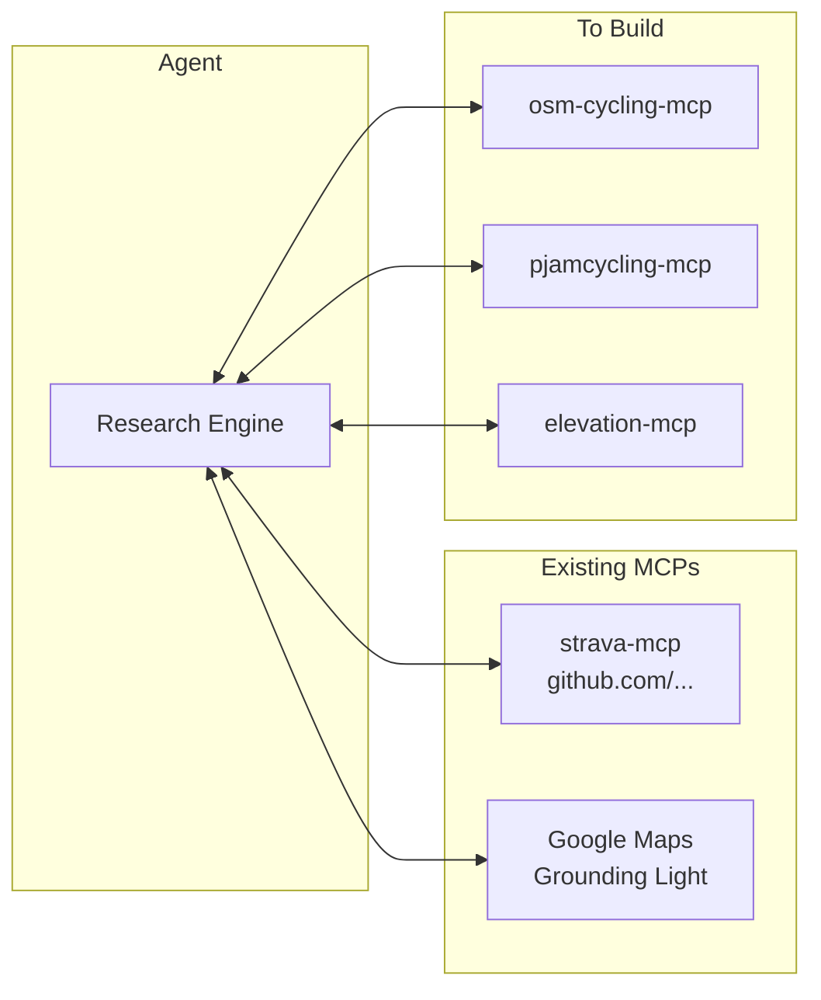

# Architecture

## System Overview

The Route Agent is built on Claude Agent SDK, using MCP (Model Context Protocol) to integrate multiple data sources. The architecture prioritizes deep research over quick responses.



## Component Details

### Query Understanding

Parses user intent into structured route requirements:

- **Destination(s)**: Named places, climbs, or coordinates
- **Distance**: Target range (e.g., 80-100 miles)
- **Constraints**: Must-visit points, avoid areas, surface preferences
- **Reference**: Past activities to use as starting points



### Research Engine

Orchestrates parallel data gathering. This is the "deep research" core - willing to make many tool calls across multiple sources.

**Research Phases:**

1. **Context Gathering**: Pull relevant Strava history, identify past routes in target area
2. **Climb Discovery**: Query PJAMCYCLING for climbs near destination
3. **Place Search**: Find cafes, grocery stores, water stops via Google Maps + OSM
4. **Route Candidates**: Use Google Maps routing to connect waypoints
5. **Enrichment**: Street View analysis, elevation profiles, segment data



### Checkpoint Manager

Controls the interaction flow. The user remains "in the driver's seat" through structured checkpoints:



**Checkpoint Types:**

| Checkpoint | Purpose | User Actions |
|------------|---------|--------------|
| Confirm Intent | Verify parsed query is correct | Confirm, clarify, add constraints |
| Present Findings | Show research results | Select interesting options, request more |
| Select Route | Choose from candidates | Pick route, request alternatives |
| Refine Route | Fine-tune details | Adjust stops, reorder waypoints |
| Present Final | Review before generation | Approve or tweak |

### Route Synthesis

Combines research into coherent route candidates:

1. **Segment Stitching**: Connect waypoints using known segments from Strava history
2. **Stop Integration**: Insert cafe/water stops at appropriate intervals
3. **Climb Sequencing**: Order climbs for optimal energy management
4. **Distance Optimization**: Adjust route to hit target mileage

### GPX Generator

Produces final GPX file with:
- Waypoints for key stops
- Track points for the route
- Metadata (name, description, expected stats)

## MCP Integration Strategy

Each data source is wrapped as an MCP server:



## Agent SDK Structure

```typescript
// Conceptual structure - not final implementation

const routeAgent = createAgent({
  name: "route-planner",
  tools: [
    stravaMCP,
    googleMapsMCP,
    osmTools,
    pjamTools,
    elevationTools,
  ],

  checkpoints: {
    confirmIntent: async (query) => { /* ... */ },
    presentFindings: async (research) => { /* ... */ },
    selectRoute: async (candidates) => { /* ... */ },
    refineroute: async (selected) => { /* ... */ },
    presentFinal: async (route) => { /* ... */ },
  },

  workflow: async (input) => {
    const query = await parseQuery(input);
    await checkpoint("confirmIntent", query);

    const research = await gatherResearch(query);
    await checkpoint("presentFindings", research);

    const candidates = await synthesizeRoutes(research);
    const selected = await checkpoint("selectRoute", candidates);

    const refined = await refineRoute(selected);
    await checkpoint("presentFinal", refined);

    return generateGPX(refined);
  }
});
```

## Open Questions

1. **Caching Strategy**: How long to cache Strava/place data between sessions?
2. **Parallel vs Sequential Research**: When to fan out vs. iterate based on findings?
3. **Error Handling**: What if a data source is unavailable?
4. **Route Quality Scoring**: How to rank candidate routes objectively?
