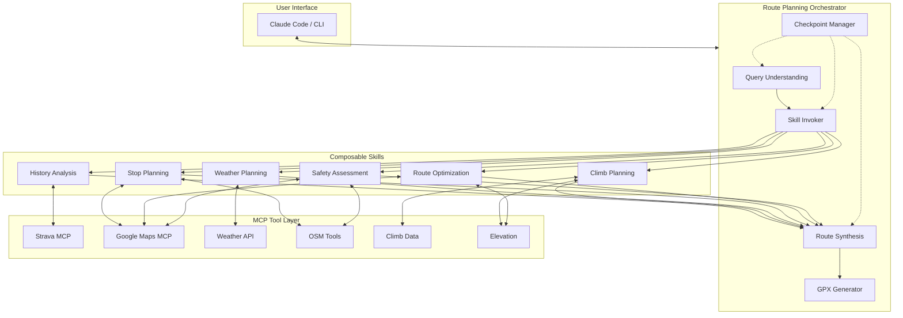
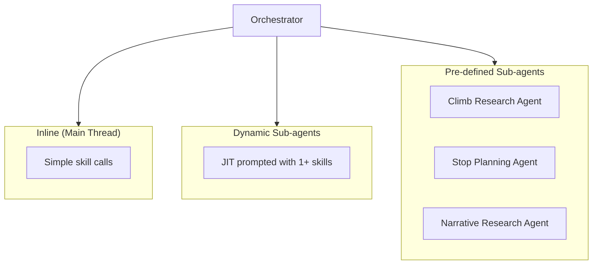
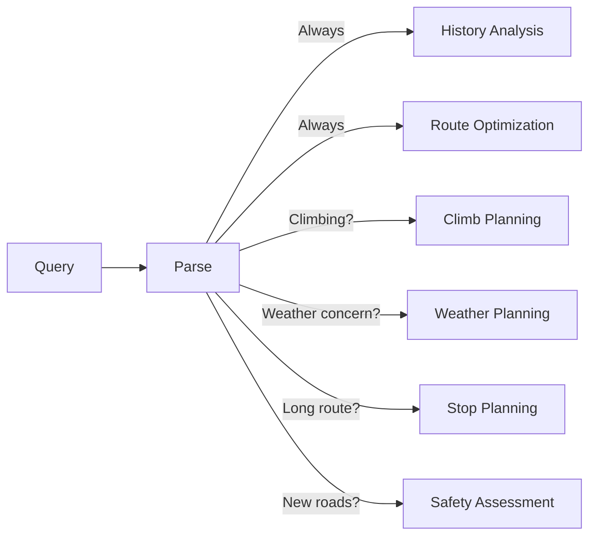
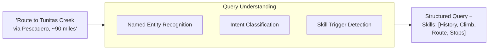
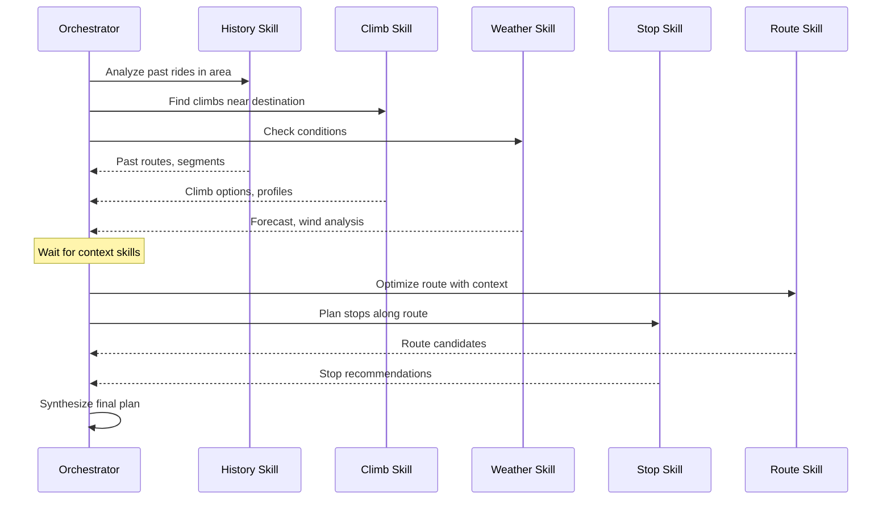
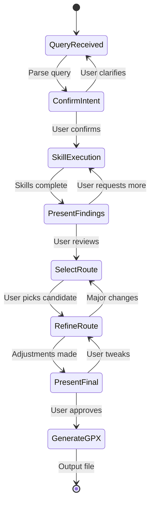

# Architecture

## System Overview

The Route Agent is built on Claude Agent SDK, using MCP (Model Context Protocol) to integrate multiple data sources. The architecture uses **composable skills** to manage context and enable conditional invocation based on route requirements.



## Core Concepts

### Skills vs Tools

**Tools** are external data sources (Strava API, Google Maps, weather services). They return raw data.

**Skills** are composable agent capabilities that use tools and encode domain expertise. Each skill:
- Has focused context (doesn't need to know about everything)
- Can be invoked conditionally based on route requirements
- Returns structured summaries, not raw data dumps
- May use one or more tools

This separation allows the orchestrator to invoke only relevant skills, keeping context focused and avoiding overload.

### Tool Criticality

Tools are classified as **Critical** or **Enhancing**:

| Type | Behavior on Failure | Examples |
|------|---------------------|----------|
| **Critical** | Block - cannot proceed | Routing (GraphHopper), Activity History (Strava) |
| **Enhancing** | Degrade gracefully - skip that enrichment | PJAMM narratives, Web search, Weather details |

The agent should complete a useful route even if enhancing tools fail. For example, if PJAMM API is unavailable, we still produce a route - just without climb narratives.

### Orchestration Model

The orchestrator has flexibility in how it composes skills:

1. **Direct invocation**: Use a skill inline in the main thread
2. **Single-skill sub-agent**: Spawn a focused sub-agent for one skill
3. **Multi-skill sub-agent**: Spawn a sub-agent with access to multiple skills
4. **Pre-defined sub-agents**: Well-scoped agents for common patterns



**Design principle**: Skills exist for flexible composition. The orchestrator decides based on query complexity whether to invoke skills directly, spawn a general sub-agent with JIT prompting, or use a specialized pre-defined sub-agent.

### Conditional Skill Invocation

| Skill | Always? | Conditional Triggers |
|-------|---------|---------------------|
| History Analysis | Yes | - |
| Route Optimization | Yes | - |
| Climb Planning | No | Climbing route, user mentions climbs |
| Weather Planning | No | Adverse conditions, long routes, summer heat |
| Food Stop Planning | No | Routes > 40mi, user mentions food/cafe |
| Water Stop Planning | No | Hot weather, remote areas, summer rides |
| Narrative Research | No | New areas, user wants local intel |
| Safety Assessment | No | Unfamiliar roads, user asks about safety |

**Note on Food vs Water**: Every food stop is implicitly a water stop. A dedicated water stop is for drinking water only (fountains, stores) when no food is needed. Water stops are critical in summer heat; may be skipped entirely in winter.



## Component Details

### Query Understanding

Parses user intent into structured route requirements and determines which skills to invoke:

- **Destination(s)**: Named places, climbs, or coordinates
- **Distance**: Target range (e.g., 80-100 miles)
- **Constraints**: Must-visit points, avoid areas, surface preferences
- **Reference**: Past activities to use as starting points
- **Skill Triggers**: What conditions require which skills



### Skill Invoker

Orchestrates skill execution based on query analysis:

1. **Parallel Fan-out**: Independent skills run concurrently
2. **Sequential Dependencies**: Some skills inform others
3. **Context Isolation**: Each skill gets focused context
4. **Result Aggregation**: Combine skill outputs for synthesis



### Checkpoint Manager

Controls the interaction flow. The user remains "in the driver's seat" through structured checkpoints:



**Checkpoint Types:**

| Checkpoint | Purpose | User Actions |
|------------|---------|--------------|
| Confirm Intent | Verify parsed query and skill selection | Confirm, clarify, add constraints |
| Present Findings | Show skill results | Select interesting options, request more |
| Select Route | Choose from candidates | Pick route, request alternatives |
| Refine Route | Fine-tune details | Adjust stops, reorder waypoints |
| Present Final | Review before generation | Approve or tweak |

### Route Synthesis

Combines skill outputs into coherent route candidates:

1. **Segment Stitching**: Connect waypoints using known segments from History skill
2. **Stop Integration**: Insert cafe/water stops from Stop Planning skill
3. **Climb Sequencing**: Order climbs from Climb Planning skill
4. **Weather Adjustment**: Factor in Weather Planning recommendations
5. **Safety Notes**: Include warnings from Safety Assessment skill

### GPX Generator

Produces final GPX file with:
- Waypoints for key stops (cafes, water, photo ops)
- Track points for the route
- Metadata (name, description, expected stats)
- Notes/warnings in waypoint descriptions

## Skill Implementation

Skills can be implemented as:
1. **Prompt-based skills**: Instructions + tool access
2. **Sub-agents**: Independent agents with focused context
3. **Hybrid**: Sub-agent for complex skills, prompts for simple ones

```typescript
// Conceptual structure - not final implementation

// Skill as sub-agent
const climbPlanningSkill = createAgent({
  name: "climb-planner",
  tools: [climbDataTool, elevationTool, stravaSegments],
  prompt: `You are an expert at planning cycling climbs...`,
});

// Skill as prompt template
const stopPlanningSkill = {
  name: "stop-planner",
  tools: [googlePlaces, osmWater],
  invoke: async (routeCorridor, constraints) => {
    // Use tools with focused context
  }
};

// Orchestrator
const routeAgent = createAgent({
  name: "route-planner",
  skills: [
    historySkill,
    climbPlanningSkill,
    weatherSkill,
    stopPlanningSkill,
    routeOptimizationSkill,
    safetySkill,
  ],

  workflow: async (input) => {
    const query = await parseQuery(input);
    const skillsNeeded = determineSkills(query);
    await checkpoint("confirmIntent", { query, skillsNeeded });

    const skillResults = await invokeSkills(skillsNeeded, query);
    await checkpoint("presentFindings", skillResults);

    const candidates = await synthesizeRoutes(skillResults);
    const selected = await checkpoint("selectRoute", candidates);

    const refined = await refineRoute(selected);
    await checkpoint("presentFinal", refined);

    return generateGPX(refined);
  }
});
```

## Context Management

Each skill operates with focused context to avoid overload:

| Skill | Context Needs | Typical Size |
|-------|--------------|--------------|
| History Analysis | User query, geographic bounds | Low |
| Climb Planning | Target area, user preferences, past climbs | Medium |
| Weather Planning | Route geometry, timing, duration | Medium |
| Stop Planning | Route corridor, distance markers, timing | Medium |
| Route Optimization | Waypoints, constraints, skill outputs | Medium |
| Safety Assessment | Specific road segments to evaluate | Low-Medium |

The orchestrator maintains global context; skills receive only what they need.

## Resolved Design Decisions

1. **Skill Granularity**: Food and Water are separate skills. Food stops are implicitly water stops; dedicated water stops are for drinking water only (fountains, stores). Water stops critical in summer, may be skipped in winter.

2. **Skill Dependencies**: Orchestrator aggregates. Skills don't see each other's outputs directly. Orchestrator decides what context to pass to each skill.

3. **Error Handling**: Tools classified as Critical vs. Enhancing. Critical tools (routing, Strava) block on failure. Enhancing tools (PJAMM, web search) degrade gracefully - agent completes route without that enrichment.

4. **Orchestration Model**: Flexible composition. Orchestrator can invoke skills inline, spawn single/multi-skill sub-agents with JIT prompting, or use pre-defined sub-agents for well-scoped problems.

5. **Caching**: On-disk caching for local development to preserve free tier API quotas.

6. **Development Approach**: Develop skills, tools, and prompts using Claude Code interactive mode. Move to Agent SDK for workflow automation once core functionality is validated.

See [tools-and-skills.md](tools-and-skills.md) for detailed skill definitions and tool catalog.
