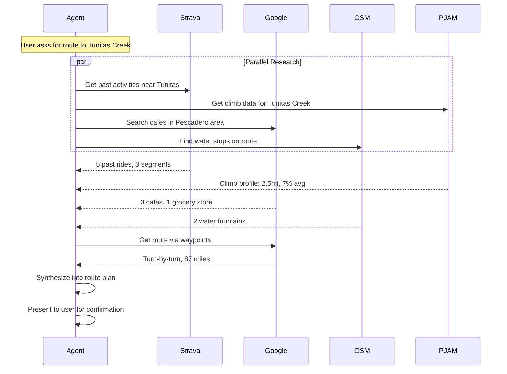

# Data Sources

This document catalogs all data sources the Route Agent integrates, their purpose, and implementation status.

## Core Sources

### 1. Strava MCP

**Purpose**: Access to personal cycling history, segments, and route data.

**Status**: Existing open-source implementation available

**Key Capabilities**:
- Fetch past activities by date range, location, or type
- Get segment data (popular climbs, personal records)
- Retrieve route details from past rides
- Search activities by geographic area

**Example Queries**:
- "Find my rides that went through Pescadero"
- "Get all activities with climbing over 8000ft"
- "Show segments I've done on Tunitas Creek"

**MCP Tools Needed**:
```
strava_get_activities
strava_search_activities_by_area
strava_get_segments
strava_get_route
```

---

### 2. Google Maps MCP (Grounding Light)

**Purpose**: Place discovery, routing, and Street View reconnaissance.

**Status**: Available via Google's Grounding Light MCP

**Key Capabilities**:
- Search for places by type (cafes, grocery stores, bike shops)
- Get routing between waypoints
- Access Street View imagery for road assessment
- Place details (hours, ratings, photos)

**Example Queries**:
- "Find cafes within 2 miles of this route corridor"
- "Get a route from point A to B via these waypoints"
- "Show Street View of this intersection"

**MCP Tools Needed**:
```
maps_search_places
maps_get_directions
maps_get_place_details
maps_street_view
```

---

### 3. OpenStreetMap Tools

**Purpose**: Cycling-specific infrastructure not in commercial maps.

**Status**: To be built

**Key Capabilities**:
- Water fountain locations (amenity=drinking_water)
- Bike repair stations
- Cycle route designations
- Surface quality data (paved, gravel, unpaved)
- Bike shop locations

**Example Queries**:
- "Find water fountains along this route"
- "What's the surface type on this road segment?"
- "Are there any designated bike routes connecting these points?"

**MCP Tools Needed**:
```
osm_find_water_stops
osm_get_surface_data
osm_find_bike_infrastructure
osm_query_overpass  # Generic Overpass API wrapper
```

**Implementation Notes**:
- Use Overpass API for querying OSM data
- Consider caching common corridor queries
- Surface data is inconsistent - may need fallbacks

---

### 4. PJAMCYCLING

**Purpose**: Detailed climb profiles and ratings.

**Status**: To be built (web scraping or API if available)

**Key Capabilities**:
- Climb profiles (gradient, length, elevation gain)
- Difficulty ratings
- Strava segment linking
- Photos and descriptions

**Example Queries**:
- "What climbs are within 20 miles of Palo Alto?"
- "Get the profile for Tunitas Creek"
- "Compare difficulty of climbs in this area"

**MCP Tools Needed**:
```
pjam_search_climbs
pjam_get_climb_profile
pjam_get_climb_stats
```

**Implementation Notes**:
- Check if API exists; otherwise web scraping
- Cache climb data (doesn't change often)
- Link to Strava segments where available

---

## Secondary Sources

### 5. Elevation Service

**Purpose**: Detailed elevation profiles for arbitrary routes.

**Status**: To be built

**Options**:
- Google Elevation API
- Open-Elevation (open source)
- Mapbox Terrain

**MCP Tools Needed**:
```
elevation_get_profile
elevation_get_point
```

---

### 6. Weather Service

**Purpose**: Current and forecast conditions for ride planning.

**Status**: Future consideration

**Options**:
- OpenWeatherMap
- Weather.gov (US)
- Visual Crossing

**MCP Tools Needed**:
```
weather_get_forecast
weather_get_current
weather_get_wind  # Critical for cycling
```

---

### 7. Road Condition / Traffic

**Purpose**: Avoid construction, heavy traffic, dangerous roads.

**Status**: Future consideration

**Options**:
- Waze data (limited API access)
- Local DOT feeds
- Community reports

---

## Data Source Matrix

| Source | Purpose | Priority | Status | Effort |
|--------|---------|----------|--------|--------|
| Strava MCP | Personal history | P0 | Available | Low |
| Google Maps MCP | Places, routing | P0 | Available | Low |
| OSM Tools | Water, infra | P1 | To build | Medium |
| PJAMCYCLING | Climb data | P1 | To build | Medium |
| Elevation | Profiles | P2 | To build | Low |
| Weather | Conditions | P3 | Future | Low |
| Traffic | Safety | P3 | Future | High |

## Tool Design Principles

1. **Consistent Interface**: All tools return structured data with common fields
2. **Geographic Awareness**: Most queries are spatially bounded
3. **Caching**: Data sources with stable data should be cached aggressively
4. **Graceful Degradation**: Missing sources shouldn't break the agent
5. **Rate Limiting**: Respect API limits, implement backoff

## Example Research Flow


