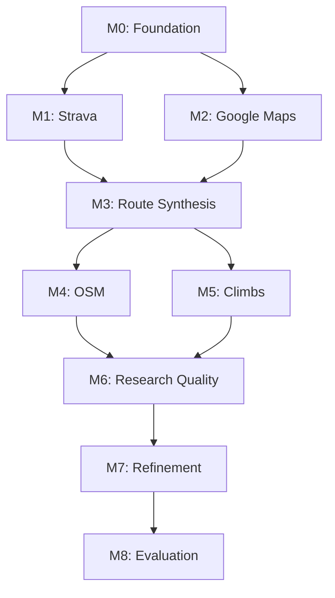

# Milestones

High-level roadmap for Route Agent development. Milestones are sequential; each builds on the previous.

## Milestone 0: Foundation

**Goal**: Basic agent skeleton running in Claude Code

**Deliverables**:
- [ ] Claude Agent SDK project structure
- [ ] Agent can receive a query and respond
- [ ] AskUserQuestion integration for checkpoints
- [ ] Basic logging/observability

**Exit Criteria**: Can run the agent in Claude Code and have a multi-turn conversation

---

## Milestone 1: Strava Integration

**Goal**: Agent understands your cycling history

**Deliverables**:
- [ ] Strava MCP integrated and authenticated
- [ ] Query activities by location/date/type
- [ ] Extract relevant past routes for a destination
- [ ] Present activity summaries to user

**Exit Criteria**: "Find rides I've done near Pescadero" returns useful results

---

## Milestone 2: Google Maps Integration

**Goal**: Place search and basic routing

**Deliverables**:
- [ ] Google Maps MCP integrated
- [ ] Search for cafes/stores along a corridor
- [ ] Get routing between waypoints
- [ ] Present place options to user for selection

**Exit Criteria**: "Find coffee stops on the way to Tunitas" returns actionable options

---

## Milestone 3: Basic Route Synthesis

**Goal**: Combine Strava history + Google routing into a plan

**Deliverables**:
- [ ] Parse user query into structured route request
- [ ] Synthesize route using past segments + new routing
- [ ] Generate valid GPX output
- [ ] Multi-checkpoint flow: intent → research → synthesis → output

**Exit Criteria**: End-to-end flow produces a downloadable GPX for a simple query

---

## Milestone 4: OSM Integration

**Goal**: Water stops and cycling infrastructure

**Deliverables**:
- [ ] Overpass API wrapper for OSM queries
- [ ] Find water fountains along a route corridor
- [ ] Surface type data where available
- [ ] Integrate water stops into route suggestions

**Exit Criteria**: Routes include suggested water stop locations

---

## Milestone 5: Climb Integration

**Goal**: Deep knowledge of climbs in the area

**Deliverables**:
- [ ] PJAMCYCLING data access (API or scraping)
- [ ] Climb search by area
- [ ] Climb profiles (gradient, length, difficulty)
- [ ] Recommend climbs matching user criteria

**Exit Criteria**: "Find a route with a challenging climb" suggests appropriate options with data

---

## Milestone 6: Research Quality

**Goal**: Agent performs expert-level multi-source research

**Deliverables**:
- [ ] Parallel data gathering from all sources
- [ ] Smart caching for repeated queries
- [ ] Conflict resolution when sources disagree
- [ ] Research summary presented clearly to user

**Exit Criteria**: Agent research quality matches what you'd do manually (but faster)

---

## Milestone 7: Route Refinement

**Goal**: Interactive fine-tuning of routes

**Deliverables**:
- [ ] User can adjust stops, reorder waypoints
- [ ] Real-time re-routing on changes
- [ ] "What if" exploration (add this climb, skip that town)
- [ ] Comparison between route variants

**Exit Criteria**: Can iterate on a route through conversation until satisfied

---

## Milestone 8: Evaluation Framework

**Goal**: Systematic quality measurement

**Deliverables**:
- [ ] Test fixtures based on real planned trips
- [ ] Automated evaluation of route quality
- [ ] Regression detection when agent changes
- [ ] Metrics: coverage, stop quality, climb matching

**Exit Criteria**: Can confidently make agent changes without degrading quality

---

## Future Milestones (Not Scoped)

- **Multi-day Routes**: Support for overnight trips with lodging
- **Weather Integration**: Factor conditions into planning
- **Social Features**: Share routes, import from friends
- **Rich UI**: Move beyond Claude Code to dedicated interface
- **Mobile Companion**: View route on phone during ride

---

## Milestone Dependency Graph

## Current Status

**Active Milestone**: Planning & Architecture (pre-M0)

Next step: Set up Claude Agent SDK project structure and basic agent loop.
