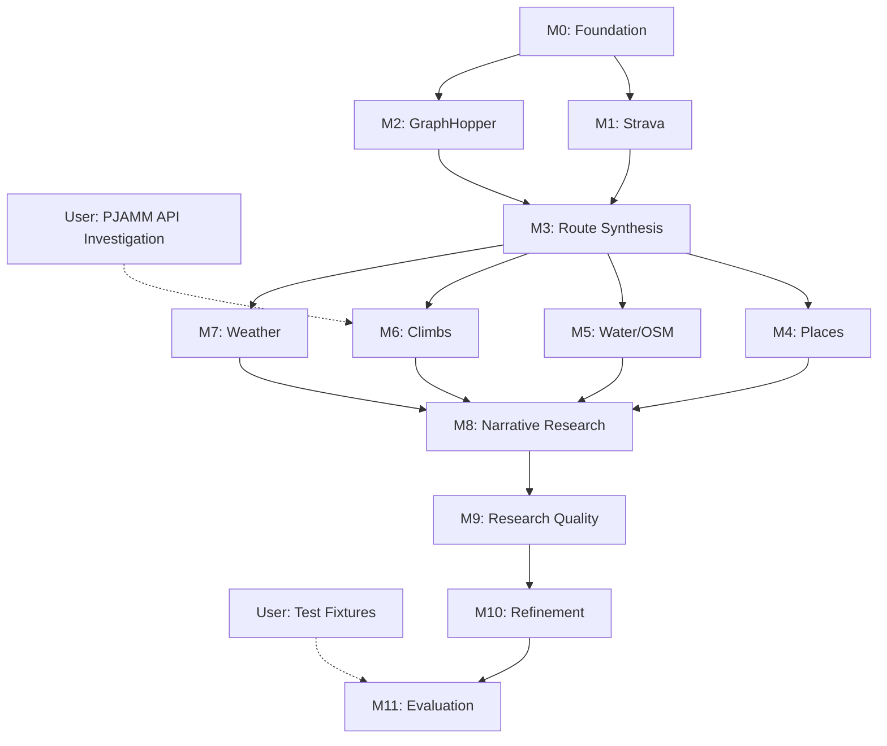

# Milestones

High-level roadmap for Route Agent development.

## User Dependencies

These items are blocked on input from the user:

| Item | Status | Notes |
|------|--------|-------|
| Test fixtures (2-3 example queries) | **Needed** | Gold-standard route requests with expected reasoning |
| PJAMM API investigation | Can start | User has paid account, can proxy mobile app |

---

## Milestone 0: Foundation

**Goal**: Basic agent skeleton running in Claude Code

**Deliverables**:
- [ ] Claude Agent SDK project structure
- [ ] Agent can receive a query and respond
- [ ] AskUserQuestion integration for checkpoints
- [ ] Basic logging/observability

**Exit Criteria**: Can run the agent in Claude Code and have a multi-turn conversation

---

## Milestone 1: Strava Integration

**Goal**: Agent understands your cycling history and preferences

This is the **highest priority** integration. The agent's value comes from understanding your past behavior and preferences, not just generic routing.

**Deliverables**:
- [ ] Strava MCP integrated and authenticated
- [ ] Query activities by location/date/type
- [ ] Query routes (planned) and activities (actual rides)
- [ ] Extract segments you've ridden
- [ ] Identify roads you've used before vs. new territory
- [ ] Present activity/route summaries to user

**Exit Criteria**:
- "Find rides I've done near Pescadero" returns useful results
- "Show me routes I've done from the Conservatory of Flowers" works with casual location reference

**Common Start Locations** (for context):
- Golden Gate Bridge
- Conservatory of Flowers, San Francisco

---

## Milestone 2: GraphHopper Integration

**Goal**: Cycling-optimized routing between waypoints

**Deliverables**:
- [ ] GraphHopper API integration (free tier)
- [ ] Cycling-specific routing profiles
- [ ] Multi-waypoint routes
- [ ] Elevation profiles included in response
- [ ] GPX generation from route response

**Exit Criteria**: Can generate a valid GPX route from point A to B via waypoints

---

## Milestone 3: Basic Route Synthesis

**Goal**: Combine Strava history + GraphHopper routing into a plan

**Deliverables**:
- [ ] Parse user query into structured route request
- [ ] Use Strava history to inform route preferences
- [ ] Synthesize route using past segments + new routing
- [ ] Generate valid GPX output
- [ ] Multi-checkpoint flow: intent → research → synthesis → output

**Exit Criteria**: End-to-end flow produces a downloadable GPX that reflects user's historical preferences

---

## Milestone 4: Place Search (Google Maps)

**Goal**: Find cafes, stores, and stops along routes

**Deliverables**:
- [ ] Google Maps MCP integrated
- [ ] Search for cafes/stores along a route corridor
- [ ] Get hours, ratings, photos
- [ ] Present place options to user for selection
- [ ] Food Stop Planning skill

**Exit Criteria**: "Find coffee stops on the way to Tunitas" returns actionable options

---

## Milestone 5: Water Stops (OSM)

**Goal**: Dedicated water stop planning for hot weather

**Deliverables**:
- [ ] Overpass API wrapper for OSM queries
- [ ] Find water fountains along a route corridor
- [ ] Identify parks with water facilities
- [ ] Water Stop Planning skill (separate from Food)

**Exit Criteria**: Summer route includes suggested water stop locations

---

## Milestone 6: Climb Integration

**Goal**: Deep knowledge of climbs in the area

**Depends on**: PJAMM API investigation (user dependency)

**Deliverables**:
- [ ] PJAMM API access via reverse-engineered mobile API
- [ ] Climb search by area
- [ ] Climb profiles (gradient, length, difficulty)
- [ ] Narrative reports and photos
- [ ] Climb Planning skill
- [ ] Fallback to climb-analyzer approach if PJAMM unavailable

**Exit Criteria**: "Find a route with a challenging climb" suggests appropriate options with PJAMM narratives

---

## Milestone 7: Weather Integration

**Goal**: Hyperlocal weather along routes

**Deliverables**:
- [ ] WeatherKit API integration (JWT auth)
- [ ] Sample route every 10 min of estimated ride time
- [ ] Wind analysis (headwind/tailwind per segment)
- [ ] Weather Planning skill
- [ ] Recommended start times based on conditions

**Exit Criteria**: Route plan includes per-segment weather forecast

---

## Milestone 8: Narrative Research

**Goal**: Enrich routes with local intel from multiple sources

**Deliverables**:
- [ ] Web search for forum posts, ride reports
- [ ] PJAMM narratives (if available)
- [ ] Synthesize local knowledge into route notes
- [ ] Graceful degradation if sources unavailable

**Exit Criteria**: Route includes narrative context ("locals recommend...", "watch for...")

---

## Milestone 9: Research Quality

**Goal**: Agent performs expert-level multi-source research

**Deliverables**:
- [ ] Parallel data gathering from all sources
- [ ] Smart caching for repeated queries
- [ ] Graceful degradation for enhancing tools
- [ ] Research summary presented clearly to user

**Exit Criteria**: Agent research quality matches what you'd do manually (but faster)

---

## Milestone 10: Route Refinement

**Goal**: Interactive fine-tuning of routes

**Deliverables**:
- [ ] User can adjust stops, reorder waypoints
- [ ] Real-time re-routing on changes
- [ ] "What if" exploration (add this climb, skip that town)
- [ ] Comparison between route variants

**Exit Criteria**: Can iterate on a route through conversation until satisfied

---

## Milestone 11: Evaluation Framework

**Goal**: Systematic quality measurement

**Depends on**: Test fixtures from user

**Deliverables**:
- [ ] Test fixtures based on real planned trips
- [ ] Automated evaluation of route quality
- [ ] Regression detection when agent changes
- [ ] Metrics: coverage, stop quality, climb matching

**Exit Criteria**: Can confidently make agent changes without degrading quality

---

## Future Milestones (Not Scoped)

- **Multi-day Routes**: Support for overnight trips with lodging
- **Social Features**: Share routes, import from friends
- **Rich UI**: Move beyond Claude Code to dedicated interface
- **Mobile Companion**: View route on phone during ride

---

## Milestone Dependency Graph

## Parallelization Opportunities

After M0 (Foundation), these can proceed in parallel:

| Stream | Milestones | Notes |
|--------|------------|-------|
| **Core** | M1 (Strava) → M3 (Synthesis) | Critical path |
| **Routing** | M2 (GraphHopper) | Joins at M3 |
| **Research** | PJAMM API investigation | User-driven, unblocks M6 |

After M3 (Route Synthesis), these can proceed in parallel:
- M4 (Places), M5 (Water), M6 (Climbs), M7 (Weather)

---

## Current Status

**Active Milestone**: Planning & Architecture (pre-M0)

**Next Steps**:
1. User provides test fixture examples
2. User begins PJAMM API investigation (proxy mobile app)
3. Set up Claude Agent SDK project structure (M0)
