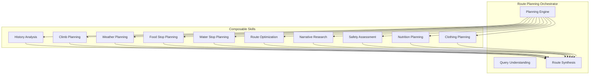
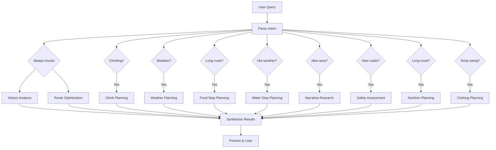

# Skills

Skills are composable research patterns that use [tools](tools.md) to accomplish route planning tasks. Each skill encapsulates domain expertise and can be invoked conditionally based on route requirements.

See [architecture.md](architecture.md) for orchestration model and design decisions.

## Skill Architecture {#skill-architecture}

## Conditional Invocation {#conditional-invocation}

| Skill | Always? | Triggers |
|-------|---------|----------|
| [History Analysis](#history-analysis) | Yes | - |
| [Route Optimization](#route-optimization) | Yes | - |
| [Climb Planning](#climb-planning) | No | Climbing route, user mentions climbs |
| [Weather Planning](#weather-planning) | No | Adverse conditions, long routes, summer heat |
| [Food Stop Planning](#food-stop-planning) | No | Routes > 40mi, user mentions food/cafe |
| [Water Stop Planning](#water-stop-planning) | No | Hot weather, remote areas, summer rides |
| [Narrative Research](#narrative-research) | No | New areas, user wants local intel |
| [Safety Assessment](#safety-assessment) | No | Unfamiliar roads, user asks about safety |
| [Nutrition Planning](#nutrition-planning) | No | Long routes, user asks about fueling |
| [Clothing Planning](#clothing-planning) | No | Temperature swings, user asks about gear |

**Note on Food vs Water**: Every food stop is implicitly a water stop. A dedicated water stop is for drinking water only (fountains, stores). Water stops are critical in summer heat; may be skipped entirely in winter.

---

## Skill Definitions {#skill-definitions}

### History Analysis {#history-analysis}

**Purpose**: Understand past rides relevant to current query

**Invocation**: Always (foundational context)

**Tools**: [Strava MCP](tools.md#1-activity-history-strava)

**Research Pattern**:
1. Parse geographic bounds from user query
2. Query Strava for activities in that area
3. Query Strava for routes in that area
4. Extract segments used before
5. Identify familiar vs. new territory
6. Surface relevant past rides as context

**Outputs**:
- Relevant past activities
- Reusable route segments
- "New roads" opportunities
- User's historical preferences for this area

---

### Climb Planning {#climb-planning}

**Purpose**: Research and select climbs for the route

**Invocation**: When route involves climbing or user mentions climbs

**Tools**: [PJAMM](tools.md#4-climb-data-pjamm), [Strava MCP](tools.md#1-activity-history-strava) (segments)

**Research Pattern**:
1. Identify target area from route/destination
2. Query PJAMM for climbs in area
3. Cross-reference with Strava segments
4. Check which climbs user has already done
5. Analyze profiles (gradient, length, difficulty)
6. Consider sequencing (harder first? save legs?)
7. Prepare alternatives at different difficulty levels

**Outputs**:
- Recommended climbs with profiles
- PJAMM narratives and photos
- Sequencing suggestions
- Alternate climb options
- "New climbs" you haven't done yet

---

### Weather Planning {#weather-planning}

**Purpose**: Assess weather impact on route timing and safety

**Invocation**: Adverse conditions, long routes, summer heat

**Tools**: [WeatherKit](tools.md#5-weather-apple-weatherkit)

**Research Pattern**:
1. Get route geometry and estimated duration
2. Calculate sample points (every 10 min of ride time)
3. Query WeatherKit for each sample point
4. Analyze wind direction vs. route direction (headwind/tailwind)
5. Identify weather windows
6. Flag precipitation timing
7. Consider heat/cold management

**Outputs**:
- Recommended start time
- Weather warnings
- Segment-by-segment conditions
- Headwind/tailwind analysis
- Contingency suggestions

---

### Food Stop Planning {#food-stop-planning}

**Purpose**: Find cafes and restaurants along route

**Invocation**: Routes > 40mi, user mentions food

**Tools**: [Google Maps MCP](tools.md#3-place-search-google-maps)

**Research Pattern**:
1. Calculate ideal stop distances based on route length
2. Identify points along route at those distances
3. Search for cafes/restaurants near each point
4. Check hours (critical for early/late rides)
5. Assess cyclist-friendliness (outdoor seating, etc.)
6. Rank by quality and convenience
7. Identify backup options

**Outputs**:
- Prioritized food stop recommendations
- Hours of operation
- Distance/timing for each stop
- Backup options if primary closed

---

### Water Stop Planning {#water-stop-planning}

**Purpose**: Find water-only stops (fountains, stores) for hydration

**Invocation**: Hot weather, summer rides, remote areas

**Tools**: [OSM Overpass](tools.md#6-water--infrastructure-osm), [Google Maps MCP](tools.md#3-place-search-google-maps)

**Research Pattern**:
1. Analyze route for remote sections
2. Consider weather (hot = more stops needed)
3. Query OSM for drinking water fountains
4. Identify parks with water facilities
5. Find stores as backup water sources
6. Assess reliability (seasonal fountains?)
7. Plan spacing for heat management

**Outputs**:
- Water stop locations
- Reliability assessment
- Distance between water sources
- Heat management recommendations

---

### Route Optimization {#route-optimization}

**Purpose**: Synthesize waypoints into optimal route

**Invocation**: Always (core synthesis)

**Tools**: [GraphHopper](tools.md#2-routing-engine-graphhopper)

**Research Pattern**:
1. Parse waypoints from user query
2. Incorporate segments from [History Analysis](#history-analysis)
3. Request cycling-optimized route from GraphHopper
4. Analyze elevation profile
5. Check for highways or unsuitable roads
6. Generate route variants (shorter/flatter vs. scenic/hilly)
7. Integrate stops from other skills

**Outputs**:
- Primary route recommendation
- Alternative variants
- Elevation profile
- Turn-by-turn directions
- GPX file

---

### Narrative Research {#narrative-research}

**Purpose**: Enrich routes with local intel from multiple sources

**Invocation**: New areas, user wants local intel

**Tools**: [PJAMM](tools.md#4-climb-data-pjamm), Web Search

**Research Pattern**:
1. Identify key locations/climbs on route
2. Gather PJAMM narratives (if available)
3. Search web for ride reports, forum posts
4. Look for local knowledge ("watch for...", "best view at...")
5. Synthesize into route notes
6. Flag any warnings or tips

**Outputs**:
- Local intel notes
- Points of interest
- Warnings and tips
- Photo opportunities

**Degradation**: If sources unavailable, skip this enrichment. Route still usable. See [Tool Criticality](architecture.md#tool-criticality).

---

### Safety Assessment {#safety-assessment}

**Purpose**: Evaluate route safety and road quality

**Invocation**: Unfamiliar roads, user asks about safety

**Tools**: [Street Imagery](tools.md#8-street-imagery-p3---deferred), [OSM Overpass](tools.md#6-water--infrastructure-osm)

**Research Pattern**:
1. Identify segments on unfamiliar roads
2. Check OSM for surface type and road class
3. Analyze Street View for road width/shoulder
4. Identify highway crossings or dangerous intersections
5. Suggest safer alternatives where possible
6. Prepare caution notes for GPX

**Outputs**:
- Safety warnings
- Alternative road suggestions
- "Caution" waypoints for GPX
- Surface quality notes

---

### Nutrition Planning {#nutrition-planning}

**Purpose**: Plan calorie consumption and on-bike fueling strategy

**Invocation**: Long routes (> 50mi), user asks about nutrition/fueling

**Tools**: [Weather Planning](#weather-planning) (heat affects consumption), Route Optimization (terrain analysis)

**Sub-agents**:
- **Nutrition Facts Agent**: Focused lookup agent for product nutrition data
  - Takes product names (commercial or generic)
  - Returns calories, carbs, protein, fat
  - Exact values for commercial products (Clif Bar, GU gel)
  - Estimated values for generic items (chocolate chip cookie, PB&J)

**Research Pattern**:
1. Calculate total calorie burn based on:
   - Distance and elevation gain
   - Terrain difficulty (climbing vs. flat)
   - Weather conditions (heat increases burn rate)
2. Estimate consumption rate per hour
3. If user provides food options, invoke Nutrition Facts Agent to get macros
4. Identify high-effort sections (climbs, headwinds)
5. Plan food stop timing for real food consumption
6. Plan on-bike nutrition for sections between stops
7. Consider fuel type by terrain:
   - Whole foods (sandwiches, bars) for steady efforts
   - Quick fuels (gels, chews) for intense climbing
   - Drink mixes for sustained hydration/calories
8. Output packing list with consumption schedule

**Domain Knowledge**:

| Fuel Type | Best For | Notes |
|-----------|----------|-------|
| Whole foods (sandwich, rice cake) | Long steady sections | Eat at stops or easy terrain |
| Energy bars | Moderate efforts | Can eat while riding |
| Gels/chews | Intense efforts, climbs | Fast absorption, no chewing |
| Drink mix | Sustained effort | Continuous calorie intake |

**Outputs**:
- Total calorie target
- Packing list (what to bring)
- Consumption schedule (when to eat what)
- Stop-specific food recommendations
- On-bike nutrition timing

**Note**: This skill works with [Food Stop Planning](#food-stop-planning) but serves a different purpose. Food Stop Planning finds where to get food; Nutrition Planning calculates what you need and when to consume it.

---

### Clothing Planning {#clothing-planning}

**Purpose**: Match clothing choices to weather conditions throughout the ride

**Invocation**: Temperature swings (> 15°F change), user asks about clothing/gear

**Tools**: [Weather Planning](#weather-planning) (conditions by segment)

**Research Pattern**:
1. Get weather by segment from Weather Planning
2. Identify temperature range (start vs. midday vs. end)
3. Consider effort level effects (climbing warms you up)
4. Plan layering strategy:
   - Base layer needs
   - Mid-layer options
   - Outer layer for wind/rain
5. Plan for transitions:
   - What to remove and when
   - Storage requirements (jersey pockets vs. bag)
6. Suggest specific gear types based on conditions

**Domain Knowledge**:

| Condition | Gear Considerations |
|-----------|---------------------|
| Cold start, warm midday | Short sleeve + removable jacket, arm warmers |
| Large temp swing (> 20°F) | Consider saddle bag for storage |
| Variable conditions | Packable wind vest |
| Descent after climb | Keep warm layer accessible |
| Arm/leg warmers | Ideal for 50-65°F, easy to remove |
| Knee warmers | Protect joints in cool temps |
| Shoe covers | Below 50°F or wet conditions |

**Layering Logic**:
- Start slightly cold (you'll warm up)
- Plan to shed layers within first 30 min
- Heavier layers for descents after climbs
- Extremities (hands, feet, ears) matter most

**Outputs**:
- Recommended clothing by segment
- Layer change points
- Storage requirements
- Specific gear suggestions (arm warmers, vest, etc.)

**Note**: The agent doesn't know your exact wardrobe, but provides guidance on weight/type of clothing and specific cycling gear options.

---

## Skill Invocation Flow {#skill-invocation-flow}

---

## Context Management {#context-management}

Each skill operates with focused context:

| Skill | Context Needs | Size |
|-------|--------------|------|
| History Analysis | Query, geographic bounds | Low |
| Climb Planning | Target area, preferences, past climbs | Medium |
| Weather Planning | Route geometry, timing, duration | Medium |
| Food Stop Planning | Route corridor, distance markers | Medium |
| Water Stop Planning | Route corridor, weather, season | Low-Medium |
| Route Optimization | Waypoints, constraints, skill outputs | Medium |
| Narrative Research | Key locations on route | Low |
| Safety Assessment | Specific road segments | Low-Medium |
| Nutrition Planning | Route profile, weather, stop locations | Medium |
| Clothing Planning | Weather by segment, terrain profile | Low-Medium |

Skills return structured summaries, not raw data dumps. The orchestrator synthesizes skill outputs into a coherent route plan.
