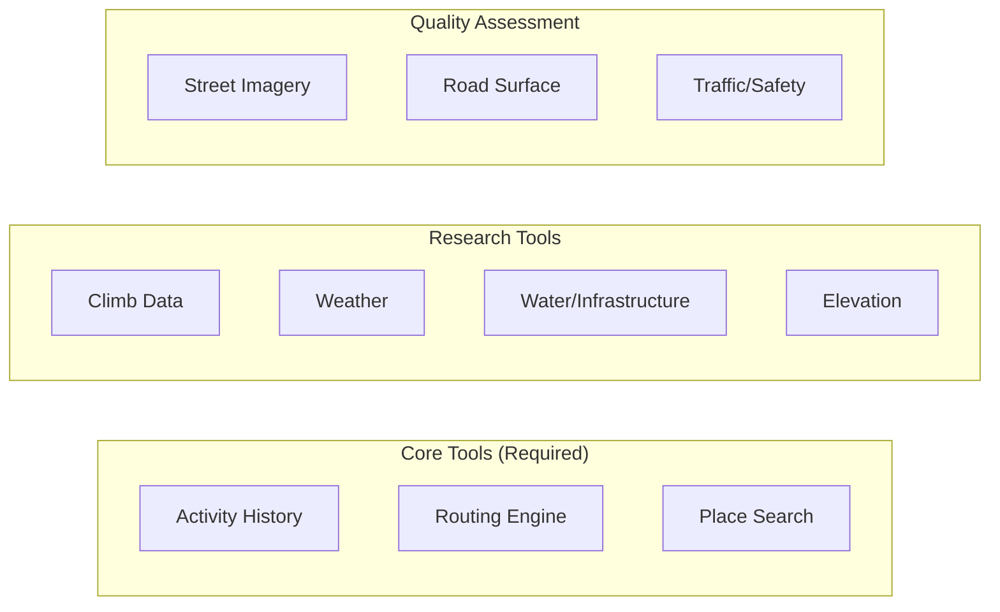
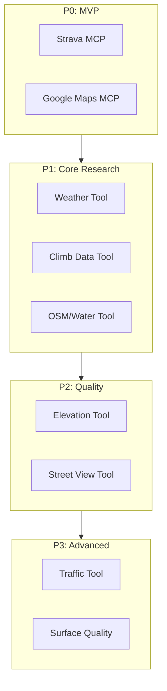
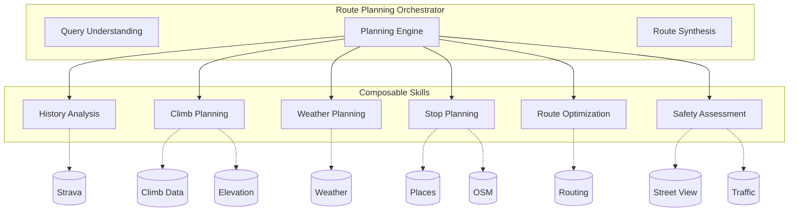
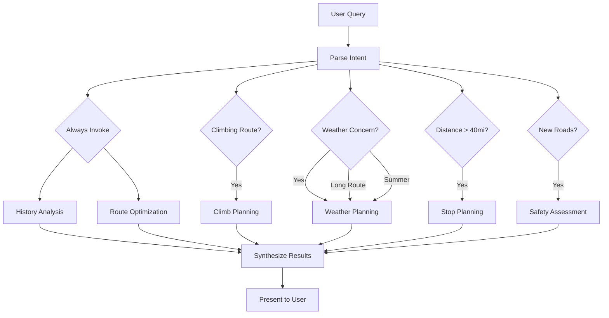
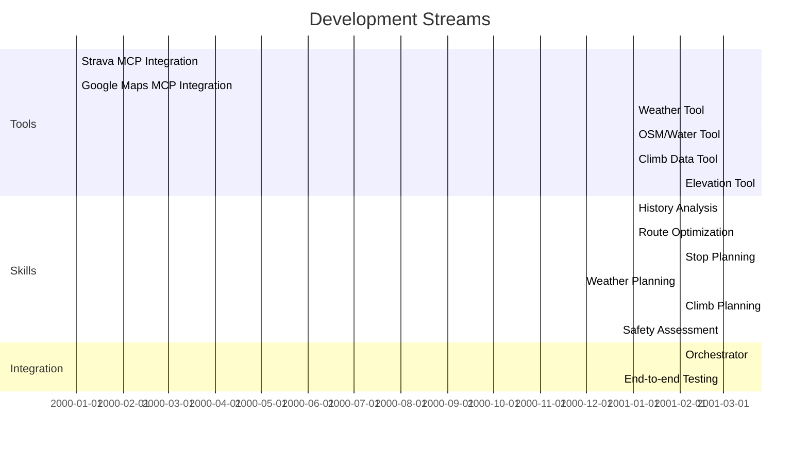

# Tools and Skills

This document catalogs the tools (external data sources) and skills (composable agent capabilities) needed for the Route Agent. Tool selection is a key early decision that enables parallel development.

## Tools

Tools provide access to external data. Each tool category may have multiple implementation options.

### Tool Categories

---

### 1. Activity History

**Purpose**: Access personal cycling history, past routes, segments

| Option | Type | Notes |
|--------|------|-------|
| Strava MCP (open source) | MCP | Existing implementation, community maintained |
| Strava API direct | REST | More control, need to handle auth |
| RideWithGPS API | REST | Alternative if user has data there |

**Required Capabilities**:
- Search activities by geographic area
- Filter by date, distance, elevation
- Get route geometry from past rides
- Access segment data (popular climbs, PRs)

---

### 2. Routing Engine

**Purpose**: Generate turn-by-turn routes between waypoints

| Option | Type | Notes |
|--------|------|-------|
| Google Maps MCP (Grounding Light) | MCP | New, includes places integration |
| Google Directions API | REST | Cycling mode, elevation data |
| GraphHopper | REST/Self-host | Open source, cycling profiles |
| OSRM | Self-host | Open source, fast, customizable |
| Brouter | Self-host | Cycling-specific, highly customizable |

**Required Capabilities**:
- Route with cycling preference
- Support waypoints (not just A→B)
- Return elevation profile
- Avoid highways/unsuitable roads

**Consideration**: May want multiple engines. Google for place-aware routing, Brouter for cycling-optimized alternatives.

---

### 3. Place Search

**Purpose**: Find cafes, grocery stores, bike shops, points of interest

| Option | Type | Notes |
|--------|------|-------|
| Google Maps MCP | MCP | Best place data, hours, ratings |
| Google Places API | REST | Direct access, more control |
| Yelp API | REST | Good for food stops |
| Foursquare | REST | Alternative place data |

**Required Capabilities**:
- Search by type within radius
- Search along a route corridor
- Get hours, ratings, photos
- Filter by currently open

---

### 4. Climb Data

**Purpose**: Detailed climb profiles, difficulty ratings, discovery

| Option | Type | Notes |
|--------|------|-------|
| PJAMM Cycling | Web/API? | Best climb data; paid service, API access unclear |
| Strava Segments | Via Strava | Popular climbs, but less curated |
| ClimbFinder | Web | European focus |
| Custom database | Local | Build from GPX + elevation data |

**Required Capabilities**:
- Search climbs by area
- Get profile (gradient %, length, elevation gain)
- Difficulty rating
- Link to Strava segment if available

**Action Item**: Reach out to PJAMM author (Bay Area local) about API access for this project.

---

### 5. Weather

**Purpose**: Hyperlocal weather data for route timing and safety

| Option | Type | Notes |
|--------|------|-------|
| OpenWeatherMap | REST | Good free tier, hourly forecasts |
| Weather.gov | REST | Free, US only, high quality |
| Tomorrow.io | REST | Hyperlocal, minute-by-minute |
| Pirate Weather | REST | Dark Sky replacement |
| Visual Crossing | REST | Historical + forecast |

**Required Capabilities**:
- Forecast at multiple points along route
- Hourly granularity minimum
- Wind speed and direction (critical for cycling)
- Precipitation probability
- Temperature by hour

**Consideration**: Weather along a 100-mile route can vary significantly. Need to query multiple points, not just start/end.

---

### 6. Water & Infrastructure (OSM)

**Purpose**: Cycling-specific infrastructure not in commercial maps

| Option | Type | Notes |
|--------|------|-------|
| Overpass API | REST | Query OSM directly |
| OSM Nominatim | REST | Geocoding/search |
| Custom OSM extract | Local | Pre-processed for cycling POIs |

**Required Capabilities**:
- Find drinking water fountains
- Locate bike repair stations
- Identify restroom facilities
- Query surface type (paved, gravel)

---

### 7. Elevation

**Purpose**: Detailed elevation profiles for arbitrary paths

| Option | Type | Notes |
|--------|------|-------|
| Google Elevation API | REST | High quality, costs at scale |
| Open-Elevation | REST/Self-host | Open source, good enough |
| Mapbox Terrain | REST | Part of Mapbox ecosystem |
| SRTM data direct | Local | Free, 30m resolution |

**Required Capabilities**:
- Elevation at arbitrary points
- Profile along a path
- Gradient calculation

---

### 8. Street Imagery

**Purpose**: Visual assessment of road conditions, scenery

| Option | Type | Notes |
|--------|------|-------|
| Google Street View API | REST | Best coverage |
| Mapillary | REST | Open source alternative, cyclist contributed |

**Required Capabilities**:
- Get imagery at coordinates
- Assess road width, surface, traffic
- Evaluate scenery quality

---

### 9. Road Surface Quality

**Purpose**: Determine pavement condition, surface type

| Option | Type | Notes |
|--------|------|-------|
| OSM surface tags | Via Overpass | Inconsistent but free |
| RoadBotics / similar | Commercial | AI-assessed pavement quality |
| Strava heatmap analysis | Derived | Popular = probably rideable |

---

### 10. Traffic & Safety

**Purpose**: Avoid dangerous roads, construction

| Option | Type | Notes |
|--------|------|-------|
| Google Traffic | Via Directions | Real-time, but car-focused |
| Strava Metro | Commercial | Cycling-specific, expensive |
| Local DOT feeds | Varies | Construction, closures |

---

## Tool Development Priority

---

## Skills

Skills are composable agent capabilities. Each skill encapsulates expertise about a specific aspect of route planning and may use one or more tools. Skills can be invoked conditionally based on route requirements.

### Skill Architecture

---

### Skill Definitions

#### 1. History Analysis Skill

**Purpose**: Understand past rides relevant to current query

**When Invoked**: Always (foundational context)

**Tools Used**: Strava MCP

**Capabilities**:
- Find past rides in target area
- Extract segments and routes used before
- Identify roads you've ridden vs. new territory
- Surface personal records, favorite routes

**Outputs**:
- Relevant past activities
- Reusable route segments
- "New roads" opportunities

---

#### 2. Climb Planning Skill

**Purpose**: Research and select climbs for the route

**When Invoked**: When route involves significant climbing or user mentions climbs

**Tools Used**: Climb Data (PJAMM), Strava Segments, Elevation

**Capabilities**:
- Discover climbs in target area
- Analyze climb profiles (gradient, length)
- Compare difficulty ratings
- Suggest climb sequencing (harder first? save legs?)
- Identify "new" climbs you haven't done

**Outputs**:
- Recommended climbs with profiles
- Sequencing suggestions
- Alternate climb options

---

#### 3. Weather Planning Skill

**Purpose**: Assess weather impact on route timing and safety

**When Invoked**:
- When weather conditions are adverse
- For long routes where conditions may change
- When user asks about timing/conditions
- Summer routes (heat management)

**Tools Used**: Weather API

**Capabilities**:
- Forecast along route corridor at multiple points
- Identify weather windows (best time to start)
- Wind analysis (headwind/tailwind on segments)
- Heat/cold planning (adjust timing)
- Rain probability and timing

**Outputs**:
- Recommended start time
- Weather warnings
- Segment-by-segment conditions
- Contingency suggestions

---

#### 4. Stop Planning Skill

**Purpose**: Find and optimize food, water, and rest stops

**When Invoked**:
- Routes over ~40 miles
- When user mentions stops
- Hot weather (water focus)
- Remote areas (limited options)

**Sub-skills**:

##### 4a. Cafe/Food Stop Planning
**Tools Used**: Google Places, Yelp

**Capabilities**:
- Find cafes/restaurants along route
- Check hours (critical for early/late rides)
- Assess appropriateness (cyclist-friendly?)
- Optimize placement (not too early, not too late)

##### 4b. Water Stop Planning
**Tools Used**: OSM (Overpass), Google Places

**Capabilities**:
- Find water fountains (parks, public facilities)
- Locate stores for water purchase
- Identify reliable vs. seasonal sources
- Plan for summer heat (more frequent stops)

##### 4c. Grocery/Resupply Planning
**Tools Used**: Google Places

**Capabilities**:
- Find grocery stores along route
- Gas stations with food (last resort)
- Convenience stores

**Outputs**:
- Prioritized stop recommendations
- Distance/timing for each stop
- Backup options if primary closed

---

#### 5. Route Optimization Skill

**Purpose**: Synthesize waypoints into optimal route

**When Invoked**: Always (core synthesis)

**Tools Used**: Routing Engine(s), Elevation

**Capabilities**:
- Generate route through waypoints
- Optimize for cycling (avoid highways, prefer bike routes)
- Balance distance vs. climbing
- Offer route variants (shorter/flatter vs. scenic/hilly)
- Handle out-and-back vs. loop preferences

**Outputs**:
- Primary route recommendation
- Alternative variants
- Elevation profile
- Turn-by-turn (for GPX)

---

#### 6. Safety Assessment Skill

**Purpose**: Evaluate route safety and road quality

**When Invoked**:
- Unfamiliar roads
- Routes with highway crossings
- When user asks about safety

**Tools Used**: Street View, OSM (surface), Traffic

**Capabilities**:
- Assess road width and shoulder
- Identify high-traffic segments
- Check surface quality
- Find dangerous intersections
- Suggest safer alternatives

**Outputs**:
- Safety warnings
- Alternative road suggestions
- "Caution" waypoints for GPX

---

### Skill Invocation Logic

---

### Skill Context Management

Each skill operates with focused context to avoid overload:

| Skill | Context Needs | Typical Token Budget |
|-------|--------------|---------------------|
| History Analysis | User query, geographic bounds | Low |
| Climb Planning | Target area, user preferences | Medium |
| Weather Planning | Route geometry, timing | Medium |
| Stop Planning | Route corridor, distance markers | Medium |
| Route Optimization | Waypoints, constraints | Medium |
| Safety Assessment | Specific road segments | Low-Medium |

Skills return structured summaries, not raw data dumps. The orchestrator synthesizes skill outputs into a coherent route plan.

---

## Parallel Development Plan

Given the tool and skill dependencies:

**Stream 1**: Core tools (Strava, Google Maps) → History + Optimization skills
**Stream 2**: Research tools (Weather, OSM, Climbs) → Corresponding skills
**Stream 3**: Orchestrator integrating skills

---

## Open Questions

1. **PJAMM Access**: What's the path to API access? Direct outreach to author?

2. **Weather Granularity**: How many points along a 100-mile route? Every 10 miles? Every town?

3. **Skill Boundaries**: Are the 6 skills the right decomposition, or should some be split/merged?

4. **Sub-agents vs. Skills**: Should complex skills (like Stop Planning with sub-skills) be implemented as sub-agents with their own tool access?

5. **Caching Strategy**: How do we cache across skills? Shared cache for common queries?
