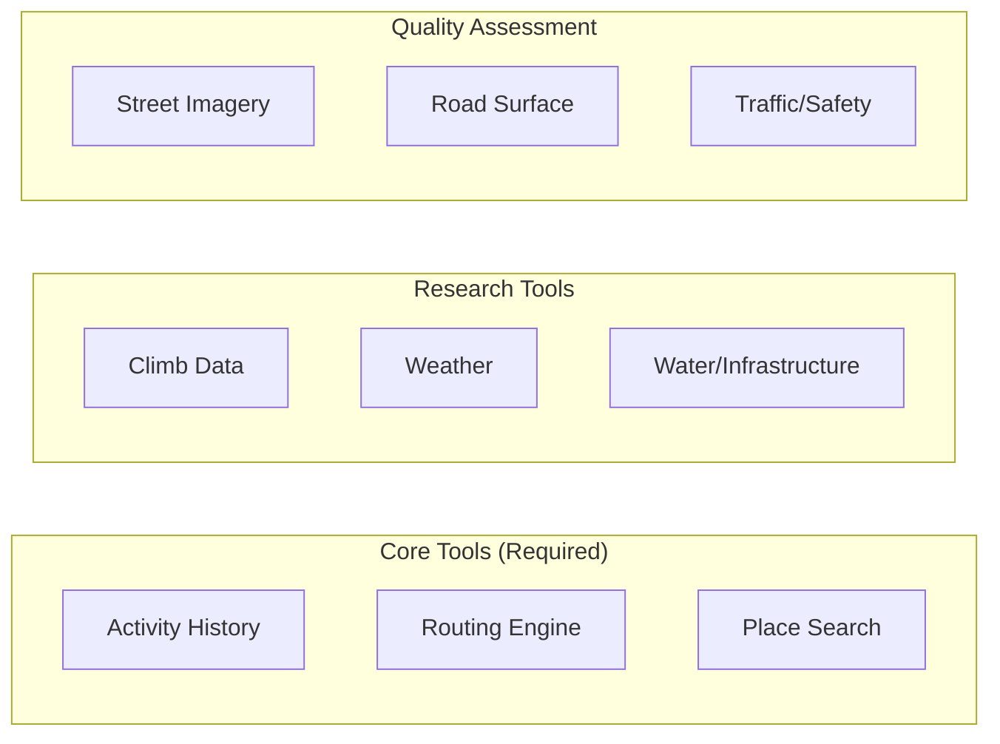
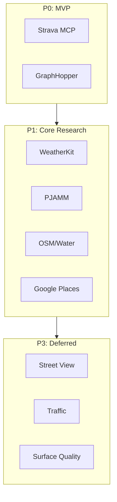

# Tools

Tools abstract access to external data sources. Each tool provides a consistent interface to an API or data service.

## Tool Categories

---

## 1. Activity History (Strava)

**Purpose**: Access personal cycling history, past routes, segments

**Implementation**: Strava MCP (open source)

**Used by**: [History Analysis](skills.md#history-analysis), [Climb Planning](skills.md#climb-planning) (for segment data)

**Capabilities**:
- Search activities by geographic area
- Filter by date, distance, elevation
- Get route geometry from past rides
- Access segment data (popular climbs, PRs)
- Query both routes (planned) and activities (actual rides)

---

## 2. Routing Engine (GraphHopper)

**Purpose**: Generate turn-by-turn routes between waypoints

**Used by**: [Route Optimization](skills.md#route-optimization)

**Why selected**: Uses the same backend as RideWithGPS and Komoot with built-in cycling profiles, open-source self-hosting, and a free API tier (500 credits/day) suitable for prototyping.

### API Details

| Tier | Credits/Day | Rate Limit | Cost |
|------|-------------|------------|------|
| Free | 500 | Limited | $0 (non-commercial) |
| Basic | More | 1 req/sec | $59/mo |
| Self-hosted | Unlimited | Your hardware | $0 |

**APIs Available**:
- Routing API (turn-by-turn with elevation)
- Geocoding API
- Map Matching API (snap GPS to roads)
- Route Optimization API

**Not in Free Tier**: Isochrone, Matrix APIs

### Integration Path

1. Start with free API for prototyping
2. Self-host for production (unlimited, no cost)
3. GraphHopper uses OSM data, updates weekly

### Backup Options

| Option | Type | Notes |
|--------|------|-------|
| Google Maps MCP | MCP | Better place integration, less cycling-aware |
| OSRM | Self-host | Faster, less feature-rich |
| Brouter | Self-host | Most cycling-specific, steeper learning curve |

---

## 3. Place Search (Google Maps)

**Purpose**: Find cafes, grocery stores, bike shops, points of interest

**Implementation**: Google Maps MCP

**Used by**: [Food Stop Planning](skills.md#food-stop-planning), [Water Stop Planning](skills.md#water-stop-planning), [Safety Assessment](skills.md#safety-assessment)

**Capabilities**:
- Search by type within radius
- Search along a route corridor
- Get hours, ratings, photos
- Filter by currently open

---

## 4. Climb Data (PJAMM)

**Purpose**: Detailed climb profiles, difficulty ratings, local intel

**Used by**: [Climb Planning](skills.md#climb-planning), [Narrative Research](skills.md#narrative-research)

### PJAMM/Sherpa Integration

PJAMM has merged with [Sherpa Map](https://sherpa-map.com/):

| Feature | Source |
|---------|--------|
| Climb narratives, photos, rankings | PJAMM |
| AI surface classification (gravel) | Sherpa |
| 28 routing profiles | Sherpa (GraphHopper backend) |
| Weather integration | Sherpa |

**User has paid PJAMM account** - will reverse-engineer mobile API.

### PJAMM Unique Value

Not replicable from open data:
- Narrative reports with firsthand local intel
- Photos of key sections
- Difficulty rankings calibrated across climbs

### Fallback: climb-analyzer

For areas PJAMM doesn't cover:
- OSM Overpass + OpenTopoData to discover climbs
- Provides metrics but no narrative/local intel
- Reference: [stevehollx/climb-analyzer](https://github.com/stevehollx/climb-analyzer)

---

## 5. Weather (Apple WeatherKit)

**Purpose**: Hyperlocal weather data for route timing and safety

**Used by**: [Weather Planning](skills.md#weather-planning)

**Why selected**: Built by the Dark Sky team (proven hyperlocal forecasting for cycling), provides 500K free API calls/month with existing Apple Developer account, and supports minute-by-minute precipitation data.

### API Details

| Tier | Calls/Month | Cost |
|------|-------------|------|
| Free (with Apple Developer) | 500,000 | $0 (already paying $99/yr) |
| 1M calls | 1,000,000 | $49.99/mo |

**500K calls/month = ~16,000/day** - more than enough.

### Integration Pattern

1. Take route geometry from GraphHopper
2. Sample points every 10 minutes of estimated ride time
3. Call WeatherKit for each sample point
4. Return per-segment forecast (temp, wind, precipitation)

Example: 100-mile ride at 15mph = 6.7 hours = 40 sample points = 40 API calls

### Authentication

WeatherKit requires JWT tokens signed with Apple Developer credentials.

### Fallback Options

| Option | Type | Notes |
|--------|------|-------|
| Weather.gov | REST | Free, US only, 2.5km grid |
| Pirate Weather | REST | 20K/month free, Dark Sky compatible |

---

## 6. Water & Infrastructure (OSM)

**Purpose**: Cycling-specific infrastructure not in commercial maps

**Implementation**: OSM Overpass API

**Used by**: [Water Stop Planning](skills.md#water-stop-planning), [Safety Assessment](skills.md#safety-assessment)

**Capabilities**:
- Find drinking water fountains (amenity=drinking_water)
- Locate bike repair stations
- Identify restroom facilities
- Query surface type (paved, gravel)

---

## 7. Elevation

**Purpose**: Detailed elevation profiles for arbitrary paths

**Used by**: [Route Optimization](skills.md#route-optimization), [Climb Planning](skills.md#climb-planning)

**Note**: GraphHopper routing responses include elevation data, so this may not need a separate tool.

| Option | Type | Notes |
|--------|------|-------|
| GraphHopper (included) | Via routing | Comes with route response |
| Open-Elevation | REST/Self-host | Open source, good fallback |
| SRTM data direct | Local | Free, 30m resolution |

---

## 8. Street Imagery (P3 - Deferred)

**Purpose**: Visual assessment of road conditions, scenery

**Will be used by**: [Safety Assessment](skills.md#safety-assessment)

| Option | Type | Notes |
|--------|------|-------|
| Google Street View API | REST | Best coverage |
| Mapillary | REST | Open source, cyclist contributed |

---

## 9. Road Surface (P3 - Deferred)

**Purpose**: Determine pavement condition, surface type

**Will be used by**: [Safety Assessment](skills.md#safety-assessment)

| Option | Type | Notes |
|--------|------|-------|
| OSM surface tags | Via Overpass | Inconsistent but free |
| Strava heatmap analysis | Derived | Popular = probably rideable |

---

## 10. Traffic & Safety (P3 - Deferred)

**Purpose**: Avoid dangerous roads, construction

**Will be used by**: [Safety Assessment](skills.md#safety-assessment)

| Option | Type | Notes |
|--------|------|-------|
| Google Traffic | Via Directions | Real-time, car-focused |
| Local DOT feeds | Varies | Construction, closures |

---

## Development Priority

