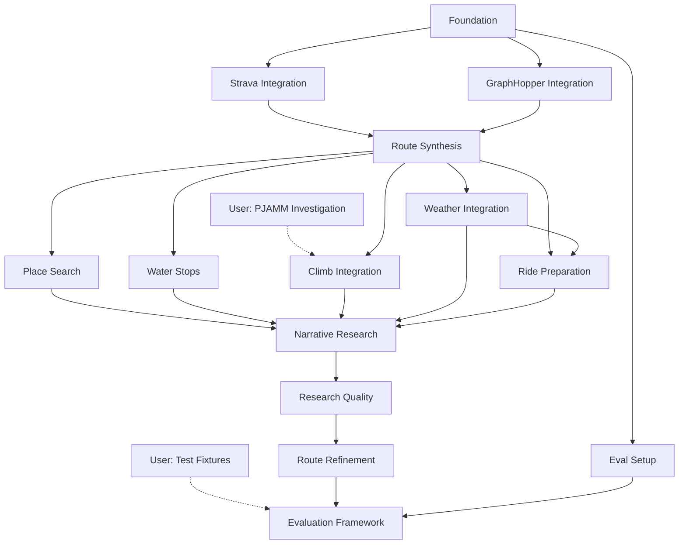

# Milestones

High-level roadmap for Route Agent development.

## User Dependencies

These items are blocked on input from the user:

| Item | Status | Notes |
|------|--------|-------|
| Test fixtures (2-3 example queries) | **Needed** | Gold-standard route requests with expected reasoning |
| PJAMM API investigation | Can start | User has paid account, can proxy mobile app |

---

## Foundation

**Goal**: Basic agent skeleton running in Claude Code

**Deliverables**:
- [ ] Claude Agent SDK project structure
- [ ] Agent can receive a query and respond
- [ ] AskUserQuestion integration for checkpoints
- [ ] Basic logging/observability

**Exit Criteria**: Can run the agent in Claude Code and have a multi-turn conversation

---

## Eval Setup

**Goal**: Establish evaluation framework and initial test cases

**Depends on**: Foundation (can run in parallel after basic setup)

**Deliverables**:
- [ ] Promptfoo installed and configured
- [ ] Directory structure for colocated evals
- [ ] First sub-agent evals (Nutrition Facts)
- [ ] Custom scorer utilities
- [ ] npm scripts for running evals

**Exit Criteria**: Can run `npm run evals` and see pass/fail results

**Start Simple**: Begin with sub-agents (narrow scope), then expand to skills and e2e.

See [docs/evals.md](../docs/evals.md) for framework details.

---

## Strava Integration

**Goal**: Agent understands your cycling history and preferences

This is the **highest priority** integration. The agent's value comes from understanding your past behavior and preferences, not just generic routing.

**Depends on**: Foundation

**Deliverables**:
- [ ] Strava MCP integrated and authenticated
- [ ] Query activities by location/date/type
- [ ] Query routes (planned) and activities (actual rides)
- [ ] Extract segments you've ridden
- [ ] Identify roads you've used before vs. new territory
- [ ] Present activity/route summaries to user

**Exit Criteria**:
- "Find rides I've done near Pescadero" returns useful results
- "Show me routes I've done from the Conservatory of Flowers" works with casual location reference

**Common Start Locations** (for context):
- Golden Gate Bridge
- Conservatory of Flowers, San Francisco

---

## GraphHopper Integration

**Goal**: Cycling-optimized routing between waypoints

**Depends on**: Foundation

**Deliverables**:
- [ ] GraphHopper API integration (free tier)
- [ ] Cycling-specific routing profiles
- [ ] Multi-waypoint routes
- [ ] Elevation profiles included in response
- [ ] GPX generation from route response

**Exit Criteria**: Can generate a valid GPX route from point A to B via waypoints

---

## Route Synthesis

**Goal**: Combine Strava history + GraphHopper routing into a plan

**Depends on**: Strava Integration, GraphHopper Integration

**Deliverables**:
- [ ] Parse user query into structured route request
- [ ] Use Strava history to inform route preferences
- [ ] Synthesize route using past segments + new routing
- [ ] Generate valid GPX output
- [ ] Multi-checkpoint flow: intent → research → synthesis → output

**Exit Criteria**: End-to-end flow produces a downloadable GPX that reflects user's historical preferences

---

## Place Search

**Goal**: Find cafes, stores, and stops along routes

**Depends on**: Route Synthesis

**Deliverables**:
- [ ] Google Maps MCP integrated
- [ ] Search for cafes/stores along a route corridor
- [ ] Get hours, ratings, photos
- [ ] Present place options to user for selection
- [ ] Food Stop Planning skill

**Exit Criteria**: "Find coffee stops on the way to Tunitas" returns actionable options

---

## Water Stops

**Goal**: Dedicated water stop planning for hot weather

**Depends on**: Route Synthesis

**Deliverables**:
- [ ] Overpass API wrapper for OSM queries
- [ ] Find water fountains along a route corridor
- [ ] Identify parks with water facilities
- [ ] Water Stop Planning skill (separate from Food)

**Exit Criteria**: Summer route includes suggested water stop locations

---

## Climb Integration

**Goal**: Deep knowledge of climbs in the area

**Depends on**: Route Synthesis, PJAMM API investigation (user dependency)

**Deliverables**:
- [ ] PJAMM API access via reverse-engineered mobile API
- [ ] Climb search by area
- [ ] Climb profiles (gradient, length, difficulty)
- [ ] Narrative reports and photos
- [ ] Climb Planning skill
- [ ] Fallback to climb-analyzer approach if PJAMM unavailable

**Exit Criteria**: "Find a route with a challenging climb" suggests appropriate options with PJAMM narratives

---

## Weather Integration

**Goal**: Hyperlocal weather along routes

**Depends on**: Route Synthesis

**Deliverables**:
- [ ] WeatherKit API integration (JWT auth)
- [ ] Sample route every 10 min of estimated ride time
- [ ] Wind analysis (headwind/tailwind per segment)
- [ ] Weather Planning skill
- [ ] Recommended start times based on conditions

**Exit Criteria**: Route plan includes per-segment weather forecast

---

## Ride Preparation

**Goal**: Help prepare for the ride with nutrition and clothing planning

**Depends on**: Route Synthesis, Weather Integration

**Deliverables**:
- [ ] Nutrition Planning skill
  - Calculate calorie needs based on route profile
  - Plan consumption timing (stops vs. on-bike)
  - Suggest fuel types by terrain (whole foods, gels, drink mix)
  - Output packing list with consumption schedule
- [ ] Nutrition Facts sub-agent
  - Look up macros for commercial products (Clif Bar, GU gel)
  - Estimate macros for generic items (cookie, sandwich)
- [ ] Clothing Planning skill
  - Match clothing to weather by segment
  - Plan layering strategy for temperature swings
  - Recommend specific gear (arm warmers, vest, shoe covers)
  - Consider storage needs for removed layers

**Exit Criteria**: Route plan includes nutrition schedule and clothing recommendations

---

## Narrative Research

**Goal**: Enrich routes with local intel from multiple sources

**Depends on**: Place Search, Water Stops, Climb Integration, Weather Integration, Ride Preparation

**Deliverables**:
- [ ] Web search for forum posts, ride reports
- [ ] PJAMM narratives (if available)
- [ ] Synthesize local knowledge into route notes
- [ ] Graceful degradation if sources unavailable

**Exit Criteria**: Route includes narrative context ("locals recommend...", "watch for...")

---

## Research Quality

**Goal**: Agent performs expert-level multi-source research

**Depends on**: Narrative Research

**Deliverables**:
- [ ] Parallel data gathering from all sources
- [ ] Smart caching for repeated queries
- [ ] Graceful degradation for enhancing tools
- [ ] Research summary presented clearly to user

**Exit Criteria**: Agent research quality matches what you'd do manually (but faster)

---

## Route Refinement

**Goal**: Interactive fine-tuning of routes

**Depends on**: Research Quality

**Deliverables**:
- [ ] User can adjust stops, reorder waypoints
- [ ] Real-time re-routing on changes
- [ ] "What if" exploration (add this climb, skip that town)
- [ ] Comparison between route variants

**Exit Criteria**: Can iterate on a route through conversation until satisfied

---

## Evaluation Framework

**Goal**: Systematic quality measurement with gold standard cases

**Depends on**: Eval Setup, Route Refinement, Test fixtures (user dependency)

**Deliverables**:
- [ ] Gold standard test fixtures from user
- [ ] E2E eval cases for full route planning
- [ ] Skill-level evals for all major skills
- [ ] Regression detection on agent changes
- [ ] Metrics dashboard: pass rate, latency, cost

**Exit Criteria**: Can confidently make agent changes without degrading quality

---

## Future Milestones (Not Scoped)

- **Multi-day Routes**: Support for overnight trips with lodging
- **Social Features**: Share routes, import from friends
- **Rich UI**: Move beyond Claude Code to dedicated interface
- **Mobile Companion**: View route on phone during ride

---

## Dependency Graph

