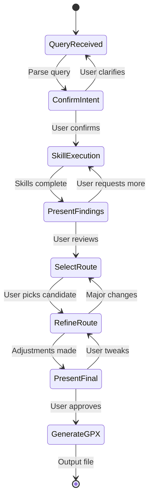

# Checkpoint System

Structured user interaction points for the Route Agent workflow.

## Overview

The Checkpoint system manages the interaction flow between the agent and user using a **tool-based architecture**. Instead of hard-coded manager classes, the agent uses:

1. **RoutePlan** - A state container that tracks workflow progress deterministically
2. **Prompt Templates** - Guide the agent on what to do at each stage
3. **Agent Tools** - The agent calls RoutePlan methods to advance workflow

This ensures the user stays in control throughout route planning while giving the agent flexibility to handle edge cases naturally.

## Architecture

The checkpoint system integrates into the orchestrator workflow as shown in `docs/architecture.md`:



## Checkpoints

### 1. Confirm Intent

**Purpose:** Verify parsed query and skill selection before research begins.

**Data:**
- Parsed query (destinations, distance, constraints)
- Skills to be invoked

**User Actions:**
- Confirm and proceed
- Clarify or correct the interpretation

### 2. Present Findings

**Purpose:** Show results from skill execution (history, climbs, weather, etc.).

**Data:**
- Skill results with summaries
- Key insights synthesized across skills

**User Actions:**
- Proceed to route generation
- Request additional research in specific areas

### 3. Select Route

**Purpose:** Choose from generated route candidates.

**Data:**
- Route candidates with distance, elevation, highlights, stops, warnings

**User Actions:**
- Select a route by number or name
- Request regeneration with different parameters

### 4. Refine Route

**Purpose:** Fine-tune the selected route.

**Data:**
- Selected route
- Proposed refinements (stops, timing, adjustments)

**User Actions:**
- Approve refinements
- Request specific changes
- Go back to route selection for major changes

### 5. Present Final

**Purpose:** Review complete route before GPX generation.

**Data:**
- Final route with all details (stops, nutrition, clothing, warnings)
- All adjustments made during refinement

**User Actions:**
- Approve and generate GPX
- Make final tweaks
- Return to refinement for larger changes

## Usage

### New Tool-Based Architecture

```typescript
import {
  createRoutePlan,
  ORCHESTRATOR_SYSTEM_PROMPT,
  getConfirmIntentPrompt,
} from "./checkpoint";

// Create state manager
const plan = createRoutePlan();

// Orchestrator agent with RoutePlan tools
const orchestrator = createAgent({
  name: "route-planner",
  systemPrompt: ORCHESTRATOR_SYSTEM_PROMPT,
  tools: [
    // State query tools
    {
      name: "get_route_state",
      description: "Get current route planning state",
      fn: () => plan.getState(),
    },
    {
      name: "get_route_summary",
      description: "Get human-readable summary",
      fn: () => plan.getSummary(),
    },
    // State update tools
    {
      name: "set_query",
      description: "Update parsed query",
      fn: (query) => plan.setQuery(query),
    },
    {
      name: "confirm_intent",
      description: "Confirm user intent and advance",
      fn: () => plan.confirmIntent(),
    },
    {
      name: "add_skill_results",
      description: "Add research findings",
      fn: (results) => plan.addSkillResults(results),
    },
    {
      name: "select_route",
      description: "Select a route by ID",
      fn: (id) => plan.selectRoute(id),
    },
    // ... other RoutePlan methods
  ],
});

// Agent workflow
async function planRoute(userInput: string) {
  // Agent parses query
  const query = await parseQuery(userInput);
  plan.setQuery(query);

  // Agent gets prompt for current stage
  const prompt = getConfirmIntentPrompt(query, skillsNeeded);

  // Agent presents to user and handles response
  const response = await askUserQuestion(prompt);

  // Agent interprets naturally and calls tools
  if (response.includes("yes") || response.includes("confirm")) {
    plan.confirmIntent();
  } else {
    plan.addUserFeedback(response);
    // Agent decides what to do next based on feedback
  }

  // Continue through workflow...
}
```

### Legacy CheckpointManager (Deprecated)

The old `CheckpointManager` class is still available but deprecated:

```typescript
import { createCheckpointManager } from "./checkpoint";

const checkpointManager = createCheckpointManager(askUserQuestion);
await checkpointManager.confirmIntent({ query, skillsNeeded });
```

**Migration:** Replace manager method calls with RoutePlan state updates and prompt-guided agent behavior.

## Key Components

### RoutePlan State Manager (`route-plan.ts`)

Provides deterministic tools for the agent to manage workflow:

- **Query state:** `getState()`, `getStage()`, `getSummary()`
- **Data updates:** `setQuery()`, `addSkillResults()`, `setCandidates()`
- **Workflow transitions:** `confirmIntent()`, `selectRoute()`, `approveFinal()`
- **User tracking:** `addUserFeedback()`, `resetToStage()`

### Prompt Templates (`prompts.ts`)

Functions that generate prompts for each workflow stage:

- **Confirm Intent:** `getConfirmIntentPrompt(query, skills)`
- **Present Findings:** `getPresentFindingsPrompt(results, insights)`
- **Select Route:** `getSelectRoutePrompt(candidates)`
- **Refine Route:** `getRefineRoutePrompt(selected, refinements)`
- **Present Final:** `getPresentFinalPrompt(route)`
- **Dynamic:** `getPromptForStage(stage, data)` - auto-selects prompt

Each prompt tells the agent:
1. What information to present to the user
2. How to ask for their input
3. Which RoutePlan methods to call based on responses

### Orchestrator System Prompt

`ORCHESTRATOR_SYSTEM_PROMPT` provides the agent with:
- Role definition (route planning orchestrator)
- Workflow stage overview
- Tool usage guidelines
- Design principles (user control, flexibility)

## Testing

Run the test suites:

```bash
# RoutePlan state manager tests (primary)
deno run src/checkpoint/evals/route-plan.test.ts

# Legacy CheckpointManager tests (deprecated)
deno run src/checkpoint/evals/checkpoint-manager.test.ts
```

RoutePlan tests validate:
- Initial state and stage transitions
- State updates for query, skills, results
- Candidate selection and route refinement
- User feedback tracking
- Stage reset functionality
- Complete workflow execution

## Design Principles

1. **Tools over methods:** Agent uses RoutePlan tools, not hard-coded manager methods
2. **Prompts over code:** Prompt templates guide behavior instead of parsing logic
3. **Deterministic state:** Always query state rather than relying on context recall
4. **Agent flexibility:** Let the agent interpret responses naturally, not through regex
5. **User control:** Agent pauses at checkpoints; user stays in command
6. **Transparency:** State is always visible and queryable
7. **Iteration:** Easy to reset stages and backtrack via `resetToStage()`

## Benefits Over Old Architecture

| Old Approach | New Approach |
|--------------|--------------|
| Hard-coded manager methods | Flexible agent tools |
| String parsing for responses | Natural language interpretation |
| Rigid workflow | Agent decides based on prompts |
| Context-dependent state | Deterministic state queries |
| Difficult to extend | Easy to add new tools/prompts |
| Lots of code | More prompts, less code |

## Files

- `types.ts` - Shared type definitions
- `route-plan.ts` - State manager with workflow tools ✨ **NEW**
- `prompts.ts` - Prompt templates for each stage ✨ **NEW**
- `index.ts` - Public exports (updated)
- `manager.ts` - ⚠️ **DEPRECATED** Old CheckpointManager class
- `evals/route-plan.test.ts` - State manager tests ✨ **NEW**
- `evals/checkpoint-manager.test.ts` - ⚠️ **DEPRECATED** Legacy tests
