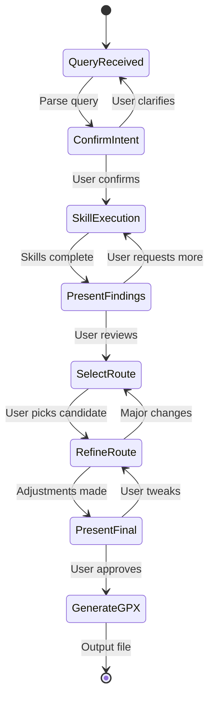

# Checkpoint System

Structured user interaction points for the Route Agent workflow.

## Overview

The Checkpoint system manages the interaction flow between the agent and user. Instead of running autonomously, the agent pauses at key decision points to present information and gather user input using `AskUserQuestion`.

This ensures the user stays in control throughout route planning, aligning with the "research assistant" design philosophy.

## Architecture

The checkpoint system integrates into the orchestrator workflow as shown in `docs/architecture.md`:



## Checkpoints

### 1. Confirm Intent

**Purpose:** Verify parsed query and skill selection before research begins.

**Data:**
- Parsed query (destinations, distance, constraints)
- Skills to be invoked

**User Actions:**
- Confirm and proceed
- Clarify or correct the interpretation

### 2. Present Findings

**Purpose:** Show results from skill execution (history, climbs, weather, etc.).

**Data:**
- Skill results with summaries
- Key insights synthesized across skills

**User Actions:**
- Proceed to route generation
- Request additional research in specific areas

### 3. Select Route

**Purpose:** Choose from generated route candidates.

**Data:**
- Route candidates with distance, elevation, highlights, stops, warnings

**User Actions:**
- Select a route by number or name
- Request regeneration with different parameters

### 4. Refine Route

**Purpose:** Fine-tune the selected route.

**Data:**
- Selected route
- Proposed refinements (stops, timing, adjustments)

**User Actions:**
- Approve refinements
- Request specific changes
- Go back to route selection for major changes

### 5. Present Final

**Purpose:** Review complete route before GPX generation.

**Data:**
- Final route with all details (stops, nutrition, clothing, warnings)
- All adjustments made during refinement

**User Actions:**
- Approve and generate GPX
- Make final tweaks
- Return to refinement for larger changes

## Usage

```typescript
import { createCheckpointManager } from "./checkpoint";

// In your orchestrator
const checkpointManager = createCheckpointManager(askUserQuestion);

// Workflow example
async function planRoute(userInput: string) {
  // Parse and confirm
  const query = await parseQuery(userInput);
  const skillsNeeded = determineSkills(query);
  const intentResponse = await checkpointManager.confirmIntent({
    query,
    skillsNeeded,
  });

  if (intentResponse.action === "clarify") {
    // Handle clarification...
  }

  // Execute skills and present findings
  const skillResults = await executeSkills(skillsNeeded, query);
  const findingsResponse = await checkpointManager.presentFindings({
    skillResults,
    insights: synthesizeInsights(skillResults),
  });

  if (findingsResponse.action === "requestMore") {
    // Execute additional research...
  }

  // Generate and select routes
  const candidates = await generateRouteCandidates(skillResults);
  const selectResponse = await checkpointManager.selectRoute({ candidates });

  const selectedId = selectResponse.details?.routeId;
  const selected = candidates.find((c) => c.id === selectedId);

  // Refine route
  const refinements = await calculateRefinements(selected);
  const refineResponse = await checkpointManager.refineRoute({
    selected,
    refinements,
  });

  // Present final
  const finalRoute = await applyRefinements(selected, refinements);
  const finalResponse = await checkpointManager.presentFinal({
    route: finalRoute,
  });

  if (finalResponse.action === "approve") {
    return generateGPX(finalRoute);
  }
}
```

## Message Formatting

Each checkpoint formats data into clear, user-friendly messages:

- **Structured presentation:** Use headings, bullet points, and clear sections
- **Actionable prompts:** Clear questions about what the user should do next
- **Relevant details:** Surface key information without overwhelming

## Response Parsing

The checkpoint manager parses natural language responses into structured actions:

- **Flexible matching:** Accept variations like "yes", "confirm", "looks good"
- **Detail extraction:** Parse route selections, change requests, etc.
- **Clarification handling:** Default to asking for clarification when ambiguous

## Testing

Run the test suite:

```bash
deno run src/checkpoint/evals/checkpoint-manager.test.ts
```

Tests validate:
- Message formatting for each checkpoint type
- Response parsing for different user input patterns
- Correct action determination based on responses
- Detail extraction from natural language

## Integration with Claude Agent SDK

The `AskUserQuestion` function is provided by the Claude Agent SDK at runtime. During development/testing, use mock implementations that return predetermined responses.

## Design Principles

1. **User control:** Never make major decisions autonomously
2. **Transparency:** Show all relevant information at each checkpoint
3. **Flexibility:** Support natural language responses, not rigid command syntax
4. **Iteration:** Allow users to go back and make changes at any point
5. **Guidance:** Provide clear prompts about available actions
