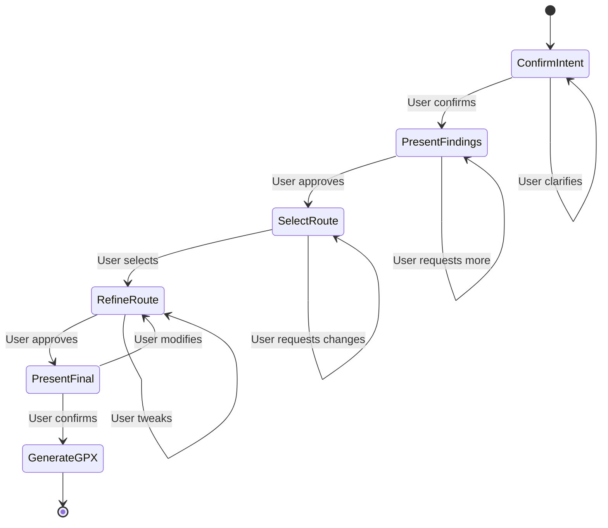

# Checkpoint System

A single-tool approach for user interaction in route planning.

## Overview

The checkpoint system uses **one simple tool** that presents route plans to users at key workflow stages. This design leverages Claude Code's permission system as the confirmation UI during testing.

### Key Concept

- **One tool**: `present_route_plan`
- **Tool call = presentation**: The data passed to the tool is visible in the permission prompt
- **Permission = approval**: User approves/rejects via Claude Code's UI
- **No state management**: Agent manages workflow in context
- **Interceptable**: Can be replaced with real UI in production

## Architecture



## Workflow Stages

### 1. Confirm Intent

**Purpose:** Verify parsed query before research begins.

**Data:**
- Parsed query (destinations, distance, constraints)
- Skills to be invoked

**User Actions:**
- Confirm and proceed
- Clarify or correct

### 2. Present Findings

**Purpose:** Show research results from executed skills.

**Data:**
- Skill results with summaries
- Key insights

**User Actions:**
- Proceed to route generation
- Request more research

### 3. Select Route

**Purpose:** Choose from generated candidates.

**Data:**
- Route options with details (distance, elevation, highlights, stops, warnings)

**User Actions:**
- Select a route
- Request regeneration

### 4. Refine Route

**Purpose:** Fine-tune the selected route.

**Data:**
- Selected route
- Proposed refinements

**User Actions:**
- Approve refinements
- Request changes
- Go back to selection

### 5. Present Final

**Purpose:** Review complete route before GPX generation.

**Data:**
- Final route with all details (stops, nutrition, clothing, warnings)

**User Actions:**
- Approve and generate GPX
- Make final tweaks

## Usage

### Basic Example

```typescript
import {
  presentRoutePlanTool,
  getConfirmIntentPrompt,
  ORCHESTRATOR_SYSTEM_PROMPT,
} from "./checkpoint";

// Create agent with the checkpoint tool
const agent = createAgent({
  name: "route-planner",
  systemPrompt: ORCHESTRATOR_SYSTEM_PROMPT,
  tools: [presentRoutePlanTool],
});

// Agent workflow example
const query = {
  destinations: ["Mount Hamilton"],
  distance: { min: 50, max: 70 },
};

const skillsNeeded = {
  history: true,
  climb: true,
  weather: true,
};

// Get prompt template for this stage
const prompt = getConfirmIntentPrompt(query, skillsNeeded);

// Agent would then call the tool:
// present_route_plan({
//   presentation: {
//     stage: "confirm_intent",
//     query: query,
//     skillsNeeded: skillsNeeded
//   },
//   prompt: "Does this match what you're looking for?"
// })

// In Claude Code, the tool call appears in permission prompt
// User sees the presentation data and approves/rejects
// Tool returns the user's response
```

### In Claude Code Testing

When the agent calls `present_route_plan`:

1. Claude Code shows permission prompt
2. User sees the `presentation` data in the prompt
3. User approves or denies via the UI
4. Tool returns `{ response: { approved: true/false, feedback?: string } }`
5. Agent processes the response and continues

### In Production

The same tool can be intercepted by a real application:

```typescript
// Custom implementation that shows proper UI
async function presentRoutePlan(input) {
  // Show presentation.stage data in your app's UI
  // Collect user input
  // Return structured response
  return {
    response: {
      approved: userApproved,
      feedback: userFeedback,
      selectedRouteId: selectedId, // if selecting route
    },
  };
}
```

## Tool Definition

### Input

```typescript
{
  presentation: {
    stage: "confirm_intent" | "present_findings" | "select_route" | "refine_route" | "present_final",
    // Stage-specific data (query, skillResults, candidates, etc.)
  },
  prompt: "Human-readable question for the user"
}
```

### Output

```typescript
{
  response: {
    approved: boolean,
    feedback?: string,
    selectedRouteId?: string
  }
}
```

## Prompt Templates

The checkpoint module provides prompt templates that guide the agent on what to include at each stage:

- `getConfirmIntentPrompt()` - What to show when confirming user intent
- `getPresentFindingsPrompt()` - How to present research findings
- `getSelectRoutePrompt()` - How to present route candidates
- `getRefineRoutePrompt()` - How to show refinements
- `getPresentFinalPrompt()` - How to present final route
- `ORCHESTRATOR_SYSTEM_PROMPT` - Overall agent guidance

These are **guidance**, not rigid templates. The agent uses them to understand what to include but presents information naturally.

## Testing

```bash
# Run checkpoint tool tests
deno test src/checkpoint/evals/tool.test.ts
```

Tests validate:
- Tool accepts correct input format for each stage
- Tool returns properly structured output
- All workflow stages work correctly

## Design Principles

1. **Simplicity**: One tool instead of complex state management
2. **Visibility**: Tool call data is visible to user
3. **Flexibility**: Agent manages workflow in context
4. **Testability**: Works with Claude Code's permission system
5. **Extensibility**: Can be replaced with real UI later
6. **Transparency**: User sees exactly what data is being presented

## Benefits Over Complex State Management

| Old Approach | New Approach |
|--------------|--------------|
| Complex state manager class | Single simple tool |
| Multiple state update methods | One tool call |
| Hard to test | Easy to test in Claude Code |
| Rigid workflow | Flexible agent-driven |
| Context-dependent | Self-contained presentations |
| Lots of code | Minimal code |

## Files

- `tool.ts` - Single checkpoint tool definition
- `prompts.ts` - Guidance templates for each stage
- `types.ts` - Shared type definitions
- `index.ts` - Public exports
- `evals/tool.test.ts` - Tool tests
- `README.md` - This file
